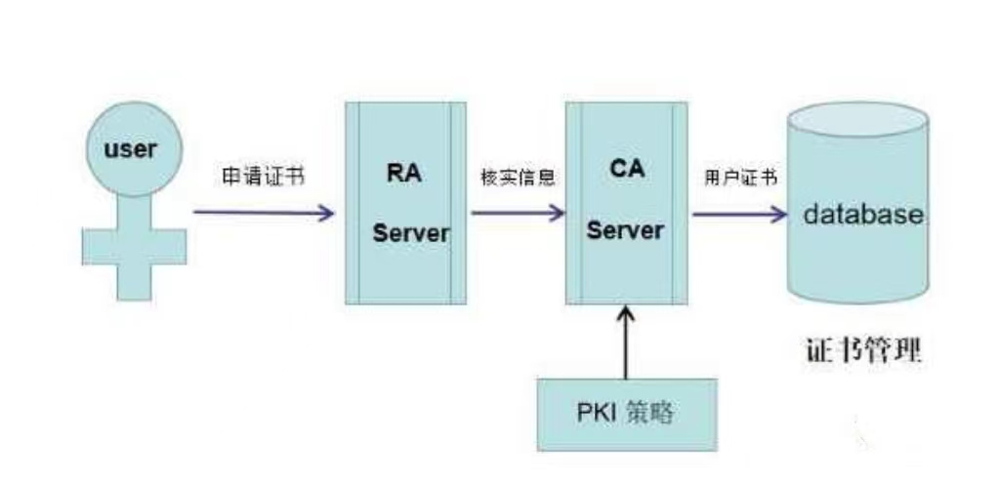
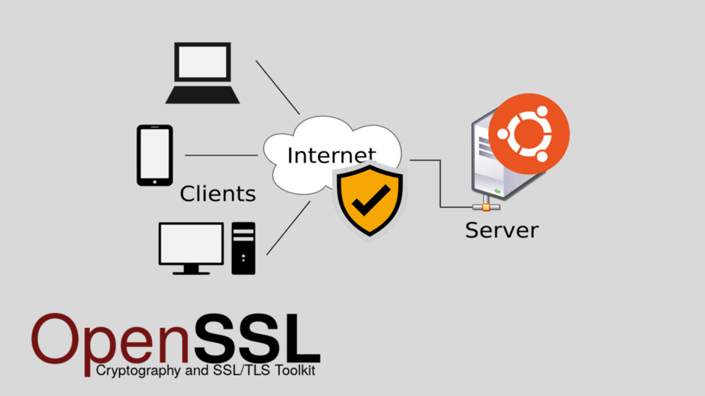
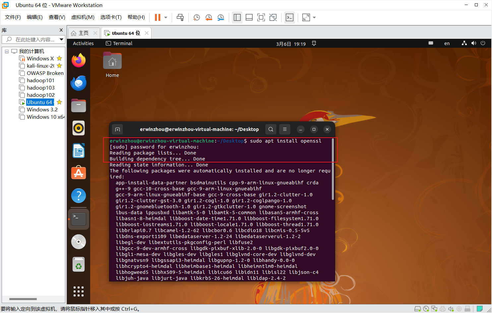
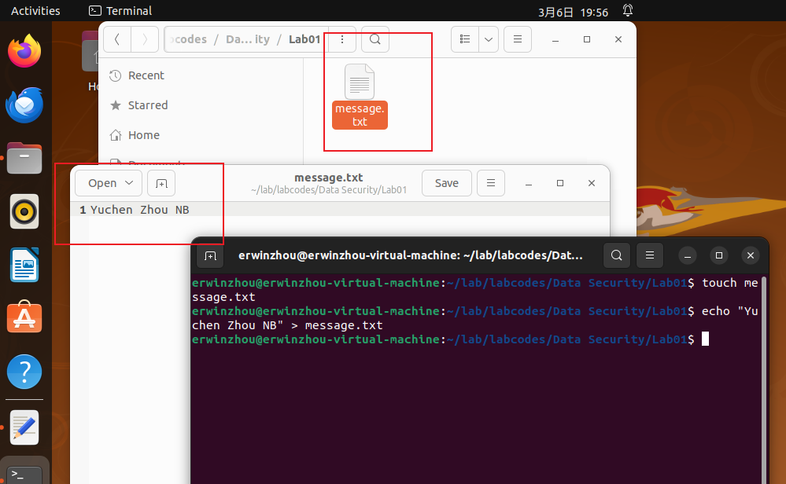
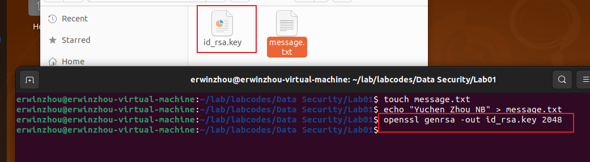
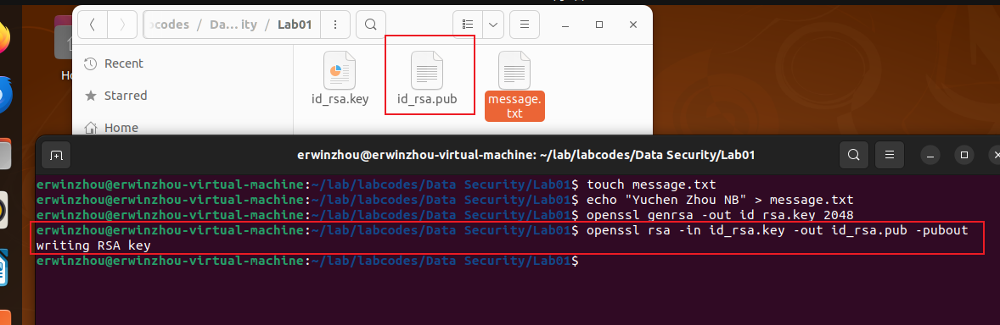
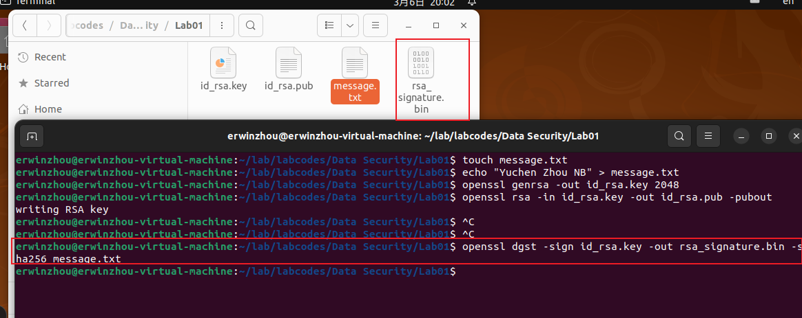
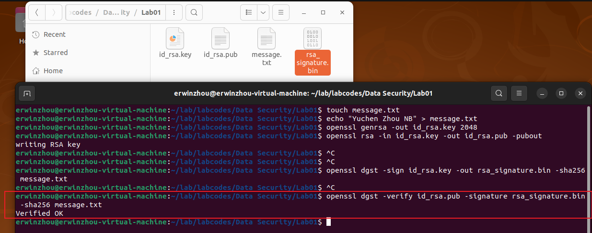
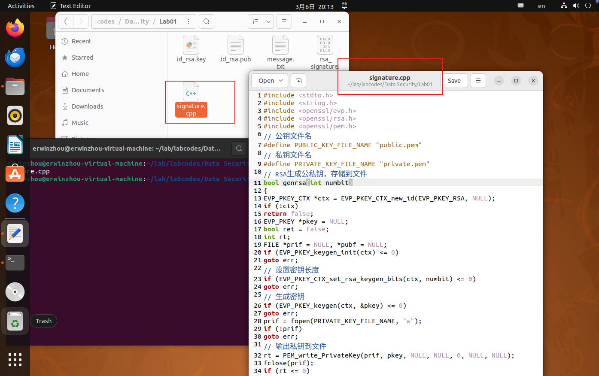
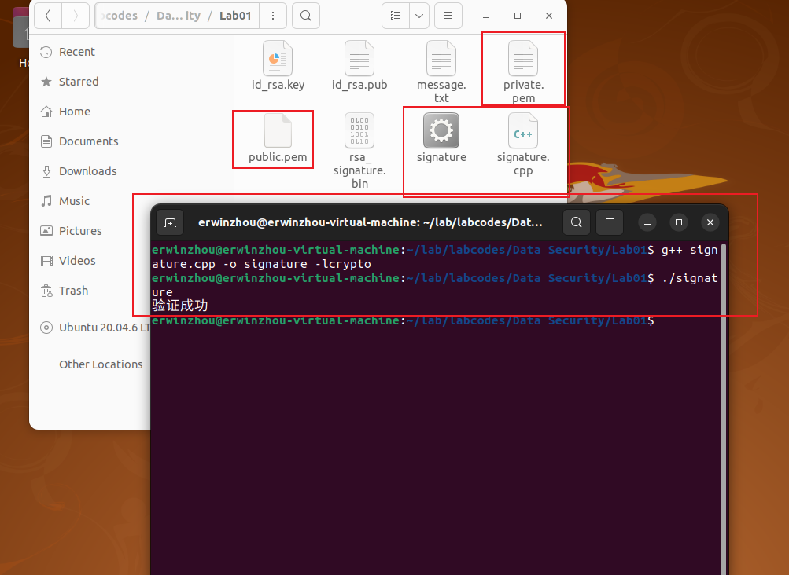

# Data Security

## Lab01: Data Signature on OpenSSL

### 专业：信息安全	学号：2111408	姓名：周钰宸

### 一.实验要求

参照教材2.3.6，实现在OpenSSL中进行数据签名及验证这一实验。

### 二.实验原理

#### 2.1 PKI 公钥基础设施

​		*"简单来说，PKI就是利用公钥理论和技术建立的提供安全服务的基础设施。"*



​		**公钥基础设施（PKI）**是一种利用公钥密码理论和技术为电子商务等提供普适性安全服务平台的基础设施。它由硬件、软件、参与者、管理政策和流程组成，旨在为所有网络应用提供加密、数字签名以及必要的密钥和证书管理体系

1. PKI的基本原理如下：
   * **证书认证机构（CA）**：CA是PKI系统中的权威机构，负责签发数字证书并将用户的公钥与身份信息绑定在一起。
   * **数字证书**：数字证书包含用户的公钥和身份信息，由CA签名，用于验证用户的身份和公钥。
   * **公钥和私钥**：每个用户都拥有一对公钥和私钥。公钥用于加密数据，私钥用于解密和签名。

2. PKI的应用广泛，包括：
   * **SSL/HTTPS**：用于保护网站通信的安全协议。
   * **IPsec VPN**：用于虚拟专用网络的加密通信。
   * **远程访问VPN**：确保远程用户的安全连接。

​	同时还有课本中提到的：

*“网上金融、网上银行、网上证券、电子商务、电子政务等网络中的数据交换提供了完备的安全服务功能。”*

#### 2.2 OpenSSL



作为一个强大的开源加密库，**OpenSSL** 在互联网的各个角落广泛应用，用于保护数据传输的安全。它实现了 **SSL** 和 **TLS** 协议，这些协议是现代网络安全的基石。

1. **OpenSSL 简介**
   * **OpenSSL** 是一个强大的加密库，用于实现 **SSL** 和 **TLS** 协议，保障网络通信的安全。
   * 它不仅提供了加密库，还包括了命令行工具，可以用于创建证书、生成密钥、测试 **SSL/TLS** 连接等

2. **主要功能**
   * **加密算法支持**：**OpenSSL** 支持多种加密算法，如 **RSA**、**AES** 等。
   * **SSL/TLS 协议实现**：提供 **SSL v2/v3** 和 **TLS** 协议的实现。
   * **证书处理**：生成和管理 **SSL** 证书。

3. **应用场景**
   * **安全通信**：用于网站、API 等的加密通信。
   * **数据加密**：用于文件、消息等的加密。

*“在PKI体系中，建有证书管理机构CA 。CA中心的公钥是公开的，因此由CA中心签发的内容均可以验证。”*

​		本次实验因为公钥也是公开的，**==主要思路是使用主机Shell模拟CA，“假装”作为一个第三方我们来对数字证书进行验证。而进行验证的工具就是OpenSSL，利用其中实现的各种协议和加密算法。==**

### 三.实验准备

1. **OpenSSL安装：**

   首先为了能够在OpenSSL上进行验证，通常需要安装OpenSSL。这里直接使用VMware下的Ubuntu虚拟机中下载并安装OpenSSL。**参考教材2.2.4的实验2.1的第一部分进行安装。**

   **这里直接使用APT软件包管理工具安装：**

   ```
   erwinzhou@erwinzhou-virtual-machine:~/Desktop$ sudo apt install openssl
   ```



2. **准备数字签名的文件：**message.txt，并写入内容"Yuchen Zhou NB"，~~一个小小的自夸哈哈。~~

   ```shell
   erwinzhou@erwinzhou-virtual-machine:~/lab/labcodes/Data Security/Lab01$ touch message.txt
   erwinzhou@erwinzhou-virtual-machine:~/lab/labcodes/Data Security/Lab01$ echo "Yuchen Zhou NB" > message.txt
   ```

   

**到此可以开始在实验文件目录下实验啦~**

### 四.实验过程

现在正式开始在VMware虚拟机的Ubuntu操作系统中对**公钥基础设施KPI的数字签名机制进行实现与验证，具体过程如下：**

#### 4.1 使用OpenSSL命令签名并验证

1. **生成2048位密钥，存储到文件id_rsa.key：**

   ```shell
   erwinzhou@erwinzhou-virtual-machine:~/lab/labcodes/Data Security/Lab01$ openssl genrsa -out id_rsa.key 2048
   ```

   

可以看到生产了对应的`id_rsa.key`文件，保存着2048位的密钥。

2. **根据私钥文件，导出公钥文件id_rsa.pub：**

   ```shell
   erwinzhou@erwinzhou-virtual-machine:~/lab/labcodes/Data Security/Lab01$ openssl rsa -in id_rsa.key -out id_rsa.pub -pubout
   writing RSA key
   ```

   

   可以看到`id_rsa.pub`对应的就是公钥(public key-Pub for abrrevation)

3. **使用私钥对文件message.txt进行签名，输出签名到message.sha256：**

   ```shell
   erwinzhou@erwinzhou-virtual-machine:~/lab/labcodes/Data Security/Lab01$ openssl dgst -sign id_rsa.key -out rsa_signature.bin -sha256 message.txt
   ```

   

可以看到`rsa_signature.bin`就是具体的数字证书，可以发现是bin二进制文件。在互联网通讯中标志通讯各方身份信息的一个数字认证，人们可以在网上用它来识别对方的身份。

4. **使用公钥验证签名：**在PKI体系中，建有证书管理机构CA (Certificate Authority) 。CA中心的公钥是公开的，因此由CA中心签发的内容均可以验证。

   这里同样因为公钥也是公开的，使用主机Shell模拟CA，“假装”作为一个第三方我们来对数字证书即`rsa_signature.bin`进行验证。**理论上若验证成功，会输出Verified OK字段。**

   ```shell
   erwinzhou@erwinzhou-virtual-machine:~/lab/labcodes/Data Security/Lab01$ openssl dgst -verify id_rsa.pub -signature rsa_signature.bin -sha256 message.txt
   Verified OK
   ```

   

**==可以看到在命令输入下成功地显示了"Verified OK"，这证明了我们使用OpenSSL命令签名并验证的实验的成功！==**

#### 4.2 数字签名程序

接下来作为**实验探索**部分，我额外对2.3.6下面的C++代码很感兴趣，便对代码框架进行了分析，**具体而言：**

1. 生成RSA公私钥对，并将其存储到文件中。
2. 使用私钥对数据进行签名。
3. 使用公钥验证数据的签名是否有效。

- `genrsa(int numbit)`: 该函数用于生成RSA公私钥对，并将其存储到文件中。首先创建一个`EVP_PKEY_CTX`对象，然后设置密钥长度，生成密钥，并分别将私钥和公钥输出到对应的文件中。
- `gensign(const uint8_t *in, unsigned int in_len, uint8_t *out, unsigned int *out_len)`: 该函数用于生成数据的签名。首先从私钥文件中读取私钥，然后初始化`EVP_MD_CTX`对象，计算消息摘要并生成签名。
- `verify(const uint8_t *msg, unsigned int msg_len, const uint8_t *sign, unsigned int sign_len)`: 这个函数用于使用公钥验证数据的签名是否有效。首先从公钥文件中读取公钥，然后初始化`EVP_MD_CTX`对象，计算消息摘要并验证签名的有效性。
- `main()`: 依次调用了上述函数，生成了长度为2048的RSA密钥对，对消息进行签名并验证签名的有效性。

```c++
#include <stdio.h>
#include <string.h>
#include <openssl/evp.h>
#include <openssl/rsa.h>
#include <openssl/pem.h>
// 公钥文件名
#define PUBLIC_KEY_FILE_NAME "public.pem"
// 私钥文件名
#define PRIVATE_KEY_FILE_NAME "private.pem"
// RSA生成公私钥，存储到文件
bool genrsa(int numbit)
{
    EVP_PKEY_CTX *ctx = EVP_PKEY_CTX_new_id(EVP_PKEY_RSA, NULL);
    if (!ctx)
        return false;
    EVP_PKEY *pkey = NULL;
    bool ret = false;
    int rt;
    FILE *prif = NULL, *pubf = NULL;
    if (EVP_PKEY_keygen_init(ctx) <= 0)
        goto err;
    // 设置密钥长度
    if (EVP_PKEY_CTX_set_rsa_keygen_bits(ctx, numbit) <= 0)
        goto err;
    // 生成密钥
    if (EVP_PKEY_keygen(ctx, &pkey) <= 0)
        goto err;
    prif = fopen(PRIVATE_KEY_FILE_NAME, "w");
    if (!prif)
        goto err;
    // 输出私钥到文件
    rt = PEM_write_PrivateKey(prif, pkey, NULL, NULL, 0, NULL, NULL);
    fclose(prif);
    if (rt <= 0)
        goto err;
    pubf = fopen(PUBLIC_KEY_FILE_NAME, "w");
    if (!pubf)
        goto err;
    // 输出公钥到文件
    rt = PEM_write_PUBKEY(pubf, pkey);
    fclose(pubf);
    if (rt <= 0)
        goto err;
    ret = true;
err:
    EVP_PKEY_CTX_free(ctx);
    return ret;
}
// 生成数据签名
bool gensign(const uint8_t *in, unsigned int in_len, uint8_t *out, unsigned int *out_len)
{
    FILE *prif = fopen(PRIVATE_KEY_FILE_NAME, "r");
    if (!prif)
        return false;
    // 读取私钥
    EVP_PKEY *pkey = PEM_read_PrivateKey(prif, NULL, NULL, NULL);
    fclose(prif);
    if (!pkey)
        return false;
    bool ret = false;
    EVP_MD_CTX *ctx = EVP_MD_CTX_new();
    if (!ctx)
        goto ctx_new_err;
    // 初始化
    if (EVP_SignInit(ctx, EVP_sha256()) <= 0)
        goto sign_err;
    // 输入消息，计算摘要
    if (EVP_SignUpdate(ctx, in, in_len) <= 0)
        goto sign_err;
    // 生成签名
    if (EVP_SignFinal(ctx, out, out_len, pkey) <= 0)
        goto sign_err;
    ret = true;
sign_err:
    EVP_MD_CTX_free(ctx);
ctx_new_err:
    EVP_PKEY_free(pkey);
    return ret;
}
// 使用公钥验证数字签名，结构与签名相似
bool verify(const uint8_t *msg, unsigned int msg_len, const uint8_t *sign, unsigned int sign_len)
{
    FILE *pubf = fopen(PUBLIC_KEY_FILE_NAME, "r");
    if (!pubf)
        return false;
    // 读取公钥
    EVP_PKEY *pkey = PEM_read_PUBKEY(pubf, NULL, NULL, NULL);
    fclose(pubf);
    if (!pkey)
        return false;
    bool ret = false;
    EVP_MD_CTX *ctx = EVP_MD_CTX_new();
    if (!ctx)
        goto ctx_new_err;
    // 初始化
    if (EVP_VerifyInit(ctx, EVP_sha256()) <= 0)
        goto sign_err;
    // 输入消息，计算摘要
    if (EVP_VerifyUpdate(ctx, msg, msg_len) <= 0)
        goto sign_err;
    // 验证签名
    if (EVP_VerifyFinal(ctx, sign, sign_len, pkey) <= 0)
        goto sign_err;
    ret = true;
sign_err:
    EVP_MD_CTX_free(ctx);
ctx_new_err:
    EVP_PKEY_free(pkey);
    return ret;
}
int main()
{
    // 生成长度为2048的密钥
    genrsa(2048);
    const char *msg = "Hello World!";
    const unsigned int msg_len = strlen(msg);
    // 存储签名
    uint8_t sign[256] = {0};
    unsigned int sign_len = 0;
    // 签名
    if (!gensign((uint8_t *)msg, msg_len, sign, &sign_len))
    {
        printf("签名失败\n");
        return 0;
    }
    // 验证签名
    if (verify((uint8_t *)msg, msg_len, sign, sign_len))
        printf("验证成功\n");
    else
        printf("验证失败\n");
    return 0;
}
```



接下来使用如下命令，**调用`g++`编译器编译并运行可执行文件`./signature`，对程序功能进行验证。**根据程序内容，若程序正确，理论上会输出**”验证成功“**。

```shell
erwinzhou@erwinzhou-virtual-machine:~/lab/labcodes/Data Security/Lab01$ g++ signature.cpp -o signature -lcrypto
erwinzhou@erwinzhou-virtual-machine:~/lab/labcodes/Data Security/Lab01$ ./signature
验证成功
```



**可以看到成功输出了“验证成功”，便完成了对数字签名程序的验证。**

**<font size=3.5, color="red">至此对2.3.6的在OpenSSL中进行数据签名及验证的和数字签名程序都进行了复现和验证，实验非常成功！</font>**

### 五.实验总结与思考

本次实验我通过在VMware的Ubuntu所承载的Linux环境下**完成了在OpenSSL中进行数据签名及验证。并额外探索了数字签名程序及其原理。**

PKI的应用非常广泛，其为网上金融、网上银行、网上证券、电子商务、电子政务等网络中的数据交换提供了完备的安全服务功能。在复现了该实验后，**我更加完整地体会到了整个数字签名的流程，加深了我对相关知识点的理解。**

作为本学期数据安全课程第一次实验，我留下了深刻的印象，**后面我一定会努力学好本课程的相关知识，用心在每次实验中提升自己的能力，不断丰富自己的技能。**