# 信息隐藏雨课堂答案

## 2024 Spring

*2025.2.24 by Erwin Zhou*

### **1.1 什么是信息隐藏**

无

### **1.3.1发展现状和分类-发展现状(1)**

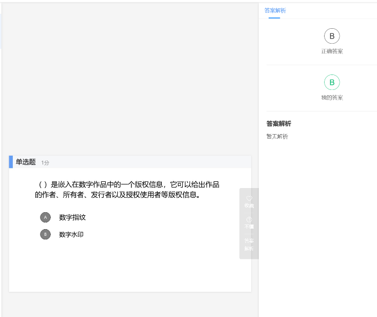

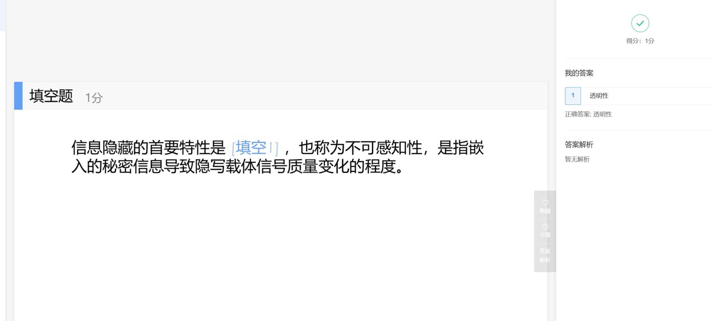

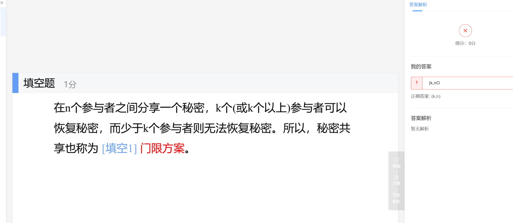

### 1.6 叠像术1016

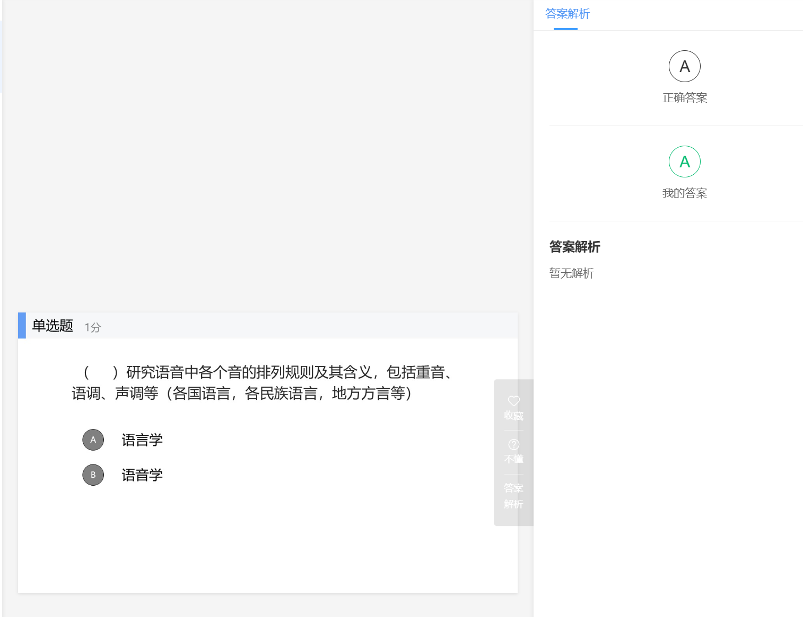

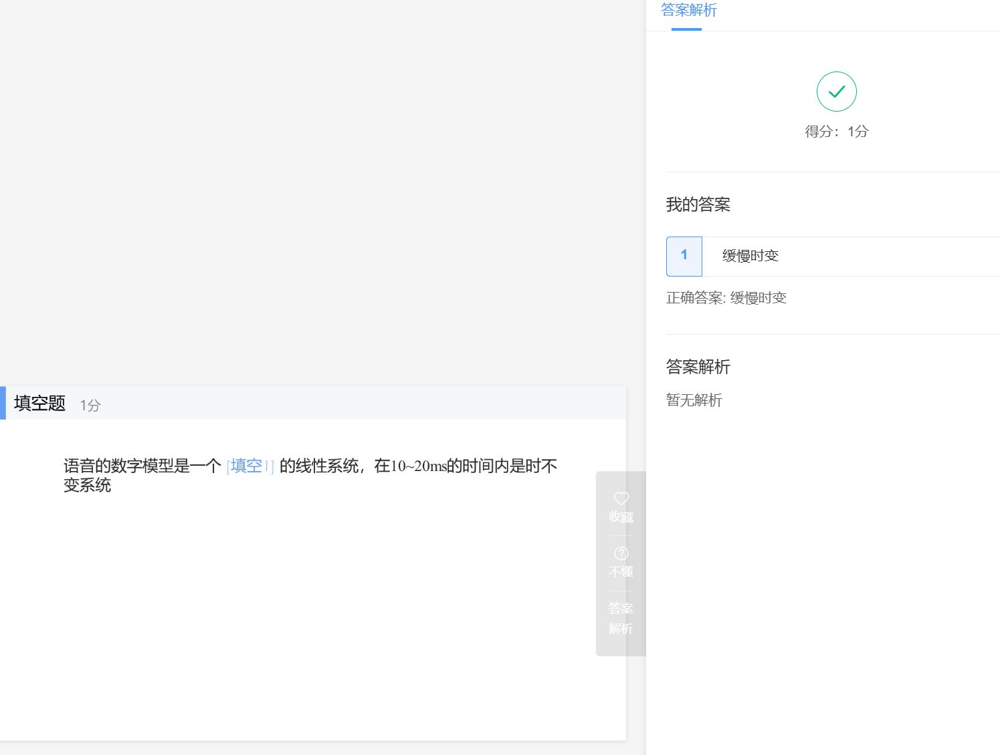

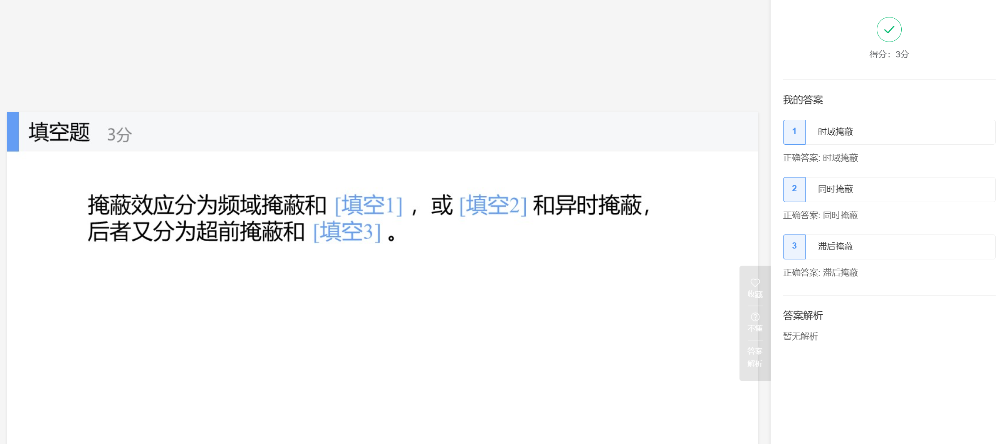

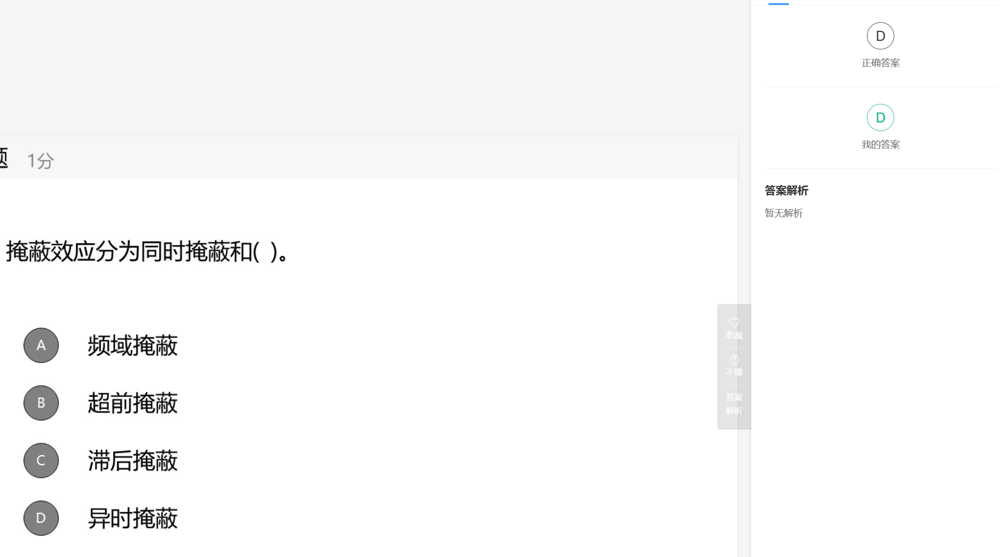

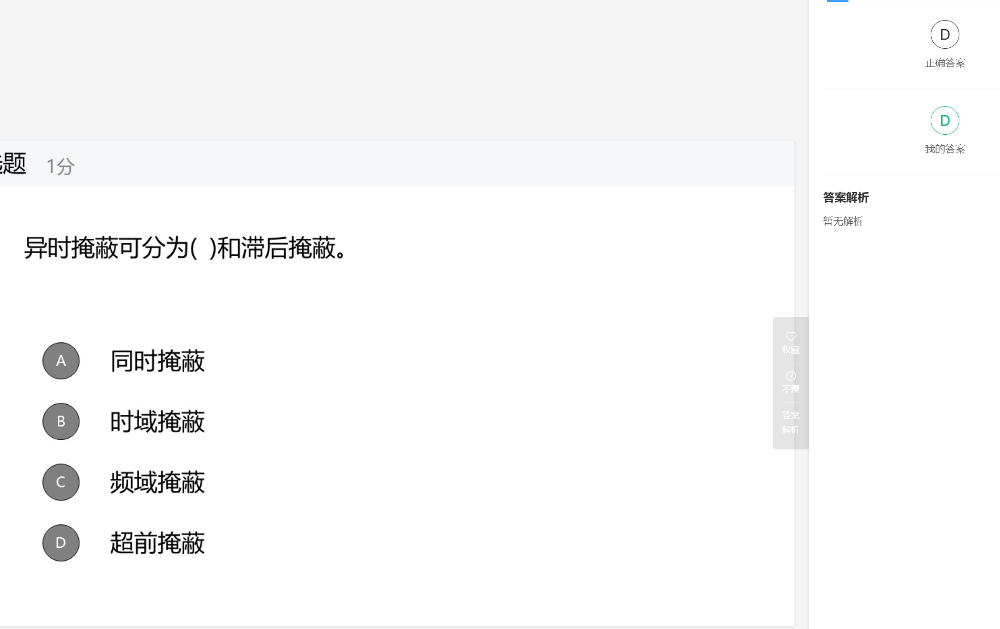

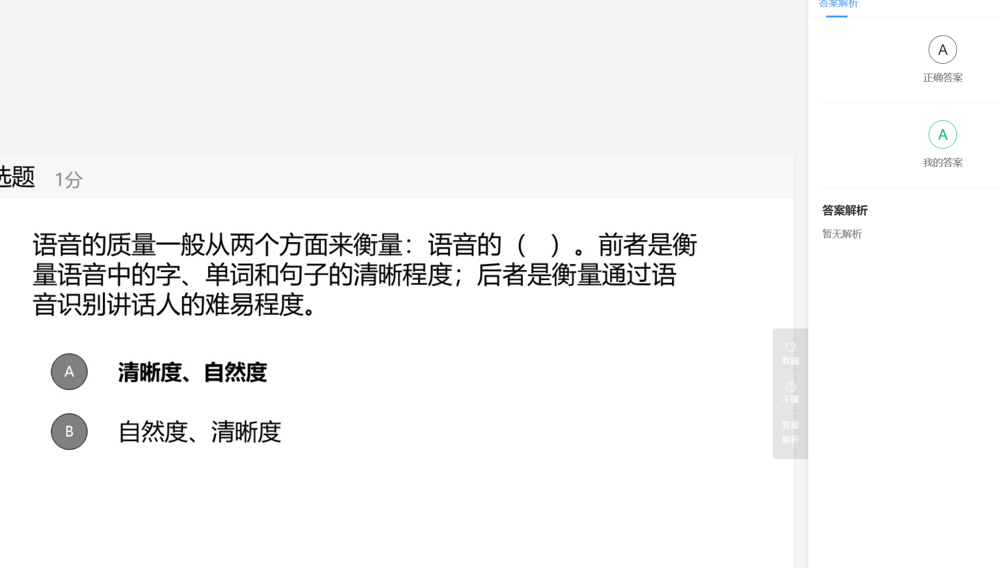

### **2.1.3语音的质量评价**

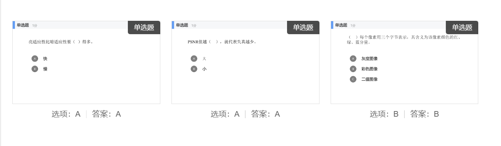

### **2.2 语音信号处理基础**

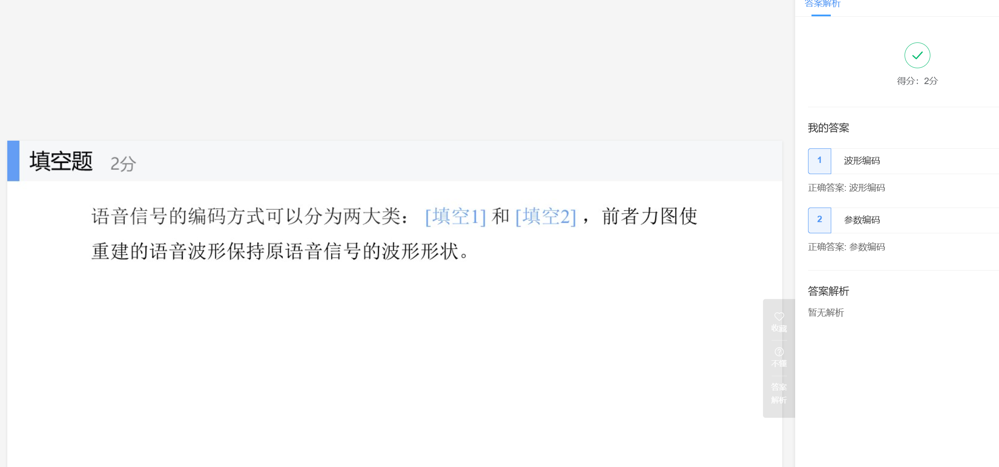

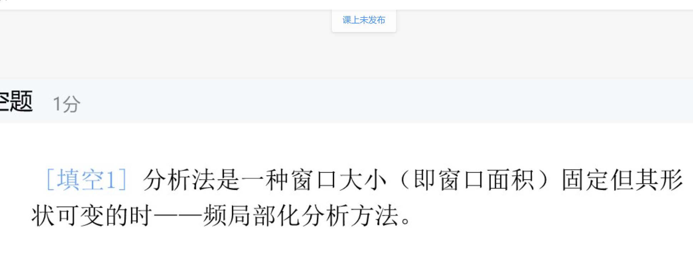

### 2.4.2 图像信号处理基础(下）

无

### 3.2 信息隐藏的分类

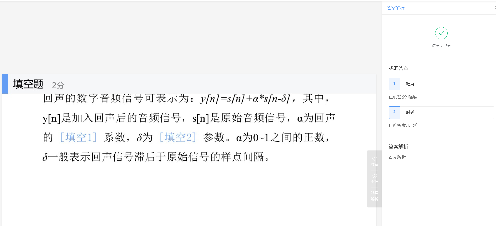

### **4.4 MP3音频的编码与解码1113**

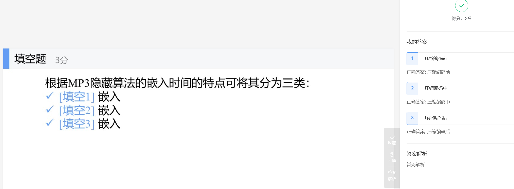

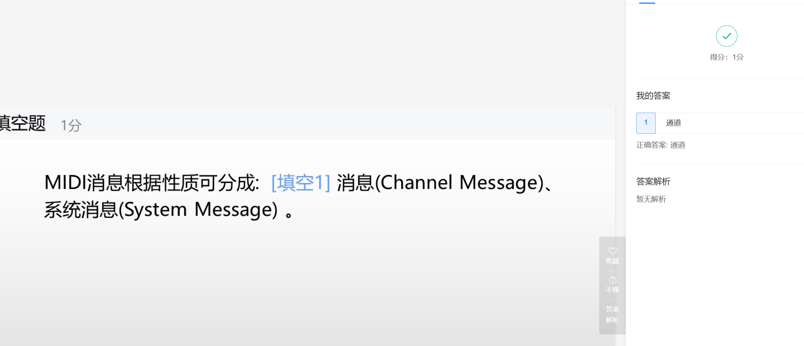

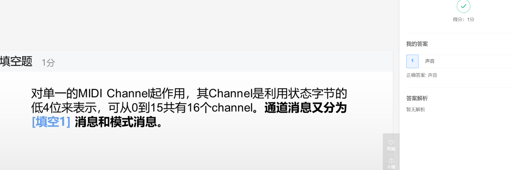

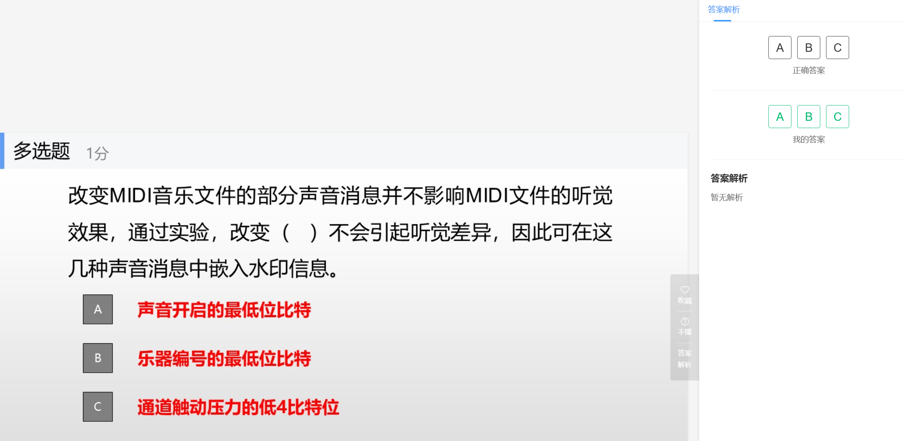

### **5.2图像的LSB方法**

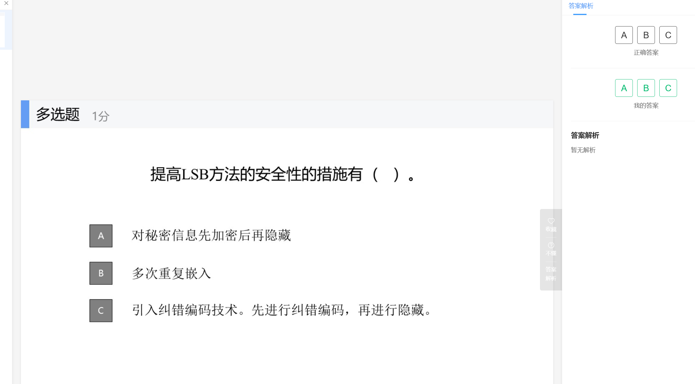

### **5.3利用奇偶校验位的方法**

无

### **5.6二值图像中的信息隐藏_录课1229修改版**

无

### **5.7 DCT域的信息隐藏_录课**

无

### **5.9 文件格式隐藏法_录课**

无

### **6.2 数字水印的定义_录课**

无

### **7.2数字水印框架-lzh**

无

### **8.3隐写分析评价指标-**

无

### **信息隐藏技术-第9章数字水印攻击_ 录课**

无