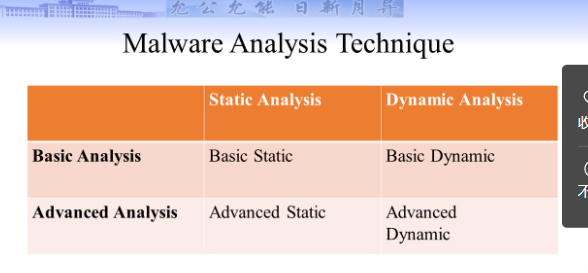
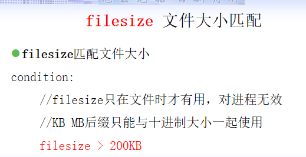
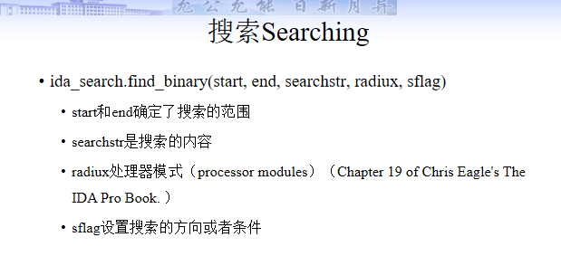
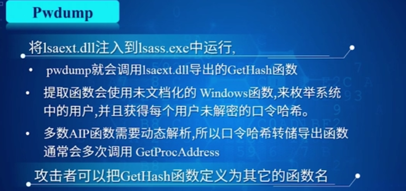
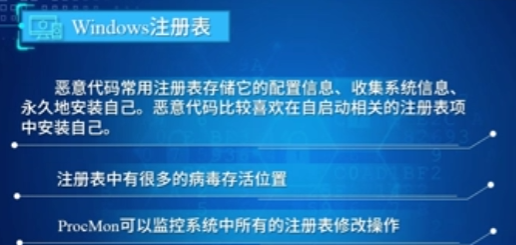
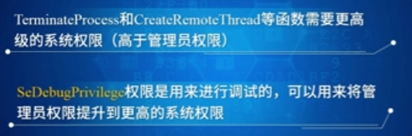
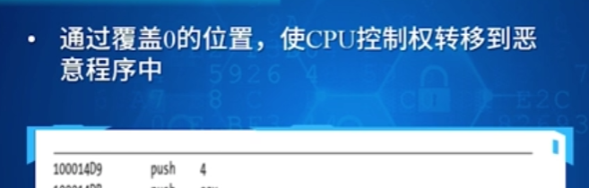
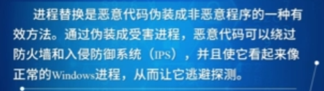
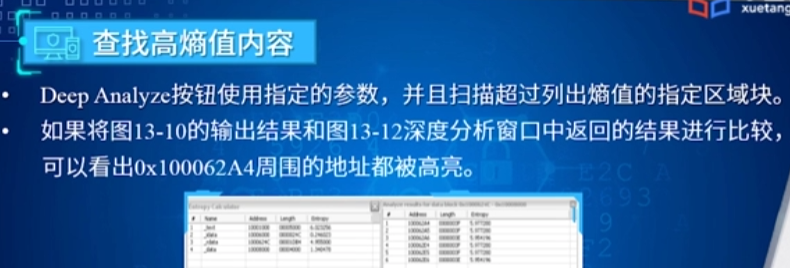

# Malware Analysis2023 

*by ErwinZhou*


## 一.概述


1. **分析目标（主要）**


2. 思政：**西北工业大学（TAO美国特定入侵行动办公室）**，CIA网络攻击，武汉地震检测中心（美国情报机构）


ABCD


**实际上机器学习加快了计算机病毒进化的过程。**


**==分析目标==**

* 究竟发生了什么

* 确保定位所有的受感染主机和文件

* **解剖所有可疑的文件（对可疑程序进程深入分析，确定该程序是否有恶意行为）——事件响应的关键步骤**

  * 如何工作的

  * 如何识别他

  * 如何防御或者消除它

    


* **找到病毒签名来检测**

  * 基于主机的签名

  * 基于网络的签名

    

* 使用机器学习建立探测模型

* 如何去衡量并且稳定住病毒造成的损失（衡量并消除恶意代码对系统造成的破坏）


3. Yara：**Identify and Classify即识别并分类**。

   保留问题？


4. **动静态分析的概念：**

   

* **静态分析：**不运行文件的前提下检查恶意文件。VirusTotal，strings，**反汇编器(disassembler)**像是IDA Pro。

* **动态分析：**运行恶意代码并观察其效果。虚拟机并使用快照。

  RegShot，Process Monitor, Process Hacker, CaptureBAT
  
  RAM分析：
  
  
  
  *Volatility*是一个内存取证框架。主要用于事件响应和恶意软件分析。使用此工具,你可以从正在运行的进程,网络套接字,网络连接,DLL和注册表蜂巢提取信息。

5. **病毒的类型：**

   

   * **Backdoor：**后门。允许攻击者能够控制系统。
   * 
   * 


Worms or viruses：


* **Botnet：**所有受感染主机都会接收来自一个C&C服务器的指示。

   * **Downloader：**下载器。恶意代码的存在仅是为了下载其他的恶意代码。会在攻击者首次获得权限时候运行。

   

   * **Information-stealing malware**

* **Launcher：stealth隐藏**
   * **Rootkit**

   

   * **Scareware**

     

   * **Spam-sending malware**

   * **Worms or viruses：**

   * **Ransomware：勒索病毒。**

   

   **总结：**

   

   按照攻击对象进行划分：

   * **Mass malware：**

   * **Targeted malware（APT）：更难以被检测到。Stuxnet。**

     

     

   

6. **基本方法：**

* 基本分析：

  * 静态：VirusTotal和strings。
  * 动态：简单但是需要安全的测试环境。并不是对所有恶意代码都有效。

  

  

* 进阶分析：

  * **静态：使用反汇编器的逆向工程。**复杂，需要对汇编代码、组织和操作系统相关概念足够熟悉。
  * **动态：需要通过调试器运行程序。**Debugger。检查运行恶意代码可执行程序的某个中间状态。

  



**ABCD**


7. **其他：**

   * 不要陷入细节
   * 尝试多种工具
   * “猫鼠”游戏

   

   


## 二.基本静态分析技术

基本静态分析工具及其功能

1. 概述：reverse engineering, **not run**。**逆向分析一个二进制可执行文件的代码或者框架去理解它的行为功能。**

2. **基本静态分析：不进行反汇编；**是动态分析和高级分析的provide good pointers
    可以从二进制代码里面找到**没有被加密的信息**，例如URLs、要感染的文件名、要修改的注册表键值、调用的Windows API函数名等等。涉及到的技术有：
* Antivirus scanning
* Hashes
* A file's strings, funtions, headers
  

  

3. **Antivirus sacnning：**卡巴斯基、诺顿、Mcafee、Trend等。

   * **基本分类：**

     * 已知病毒：病毒签名、启发式算法
     * 未知病毒：Obfuscation混淆
       Polymorphic（多态）: syntax obfuscation 语法混淆
       Metamorphic（变形）: semantic obfuscation 语义混淆
     * 

     

   * (Collection of Antivirus Toools)集大成者VirusTotal

4. **Hashes：Method to uniquely identify malware**

   eg.**HashCalc**

   * **优缺点**

   

   * 基本技术：
   
     * MD5：Message-Digest Algorithm
       （128-bit hash）
     * SHA1：Secure Hash Algorithm
       （160-bit hash）

   * arbitary：任意的；MD5会发生碰撞不会不经常发生（碰撞即有相同的Hash值）
   
     
     
   * 用途：**标签；共享；前人之鉴**
   
     
   
5. Strings：a sequence of printable characters.

   * Use 0 and 1 to represent characters

     ****

     **ASCII：8 bit。**
     **UNICODE：16 bit。**135 modern or historic scripts

     

   * Search binary executable for **ASCII and Unicode** strings 
     **Three or greater** sequence of characters
     Followed by a **terminator**

   * **隐藏字符串：==加密，加壳，压缩，混淆。==**

   * 

     

   * Packed and Obfuscated Malware：**==加壳是混淆的子集！==**

     **共同目标：压缩体积，隐藏重要信息。使病毒更难以被逆向或者探测**

     * **混淆：隐藏可执行信息**

     * 加壳：压缩二进制文件大小。令strings和指令都无法被阅读。**只能看到wrapper，unpack运行时。**

       eg.UPX---->PEiD

       

     * 合法的程序很多strings，加壳或者混淆后一般来说会很少。不过也不一定。**==不一定减少字符串的数量，因为会出现很多垃圾字符串==**

       

6. **==可执行文件格式：==**

   Windows中的exe和DLLs。（**几乎**所有在Windows上执行的文件都是PE格式）Contains the information necessary for **Windows to load the binary executable**

   

   * **==PE文件头：==**

     

     * Information about the code
     * Type of application
     * Required library functions
     * Space requirements
     * Code Entry point

   * 工具：LordPE

7. Linked Libraries and Functions连接库函数

   * 导入：Connected to the main EXE by **Linking。即从另一个程序如库中导入函数。**

   * **三种链接方式：Statically, At Runtime, Dynamically**

     

     * **Static Linking**：Windows的exe很少使用，Unix and Linux常用。库中代码直接复制过来，更多内存空间，文件大小更大。

     * **Dynamical Linking：**最常见的方式。**load加载程序时候搜索！**

       

     * **==Runtime Linking：在合法的程序中不常用，但是在malware中，尤其是加壳和混淆过的很常见。==**

       * Connect to libraries **only when needed**, not when the program starts
       * **LoadLibrary, GetProcAddress**

     * **PE文件头**包含了线索

       

8. **Dependency Walker：Shows ==Dynamically（普通程序多，病毒少）== Linked Functions。**

   * **<font size=5, color="red">常见DLLs</font>**

     **Advapi32.dll：服务Manager和注册表**

     User32：用户接口组件，按钮。包括回复用户响应窗口等。

     Gdi32：画图

     **Ntdll：Windows内核的接口。**通过Kernel间接导入。**想要使用一些一般的Windows程序不允许使用的。隐藏功能与操作进程用到。**

     

     

   * **DLL导出函数，EXE导入函数。**

     Both exports and imports are listed in the **PE header**

9. **PE文件头和节：**

   

   * Time Data Stamp：**编译**的时间。老的病毒更出名。有时候会错，可以造假。
	  
	
	* **IMAGE_SECTION_HEADER**
	
	  RAM虚拟，Size of Raw Data。一般对于.text节二者近乎相等。**但加壳的文件前者大很多。**
	
	  ​	
	
	* **Resource Hacker：浏览.rsrc节。**Strings, icons, and menus

## 三.Yara检测引擎


Yara就是把静态分析的结果等转换为杀毒软件

* **VirusTotal开发，开源查杀恶意代码。识别与分类。引擎跨平台。**

* 本身不提供杀毒功能。没有特征库，需要编写Yara规则，以此来识别和分类恶意软件或者程序。

  

* 直接编写python程序来调用Yara引擎。

1. 正则表达式

2. **Yara规则（重点）**正则与条件表达式。

   

   * **Yara规则：==一系列字符串和一个布尔型表达式==。支持与或非等多种条件。**

     * **规则标识符Identifier，==第一个字符不能是数字，长度不超过128字符，区分大小写。==**

       

       
       
       注释和C一样
     
   * **Yara字符串：**三种。十六进制（字节！）、文本、**正则表达式。**

       

      * **通配符：?（单位是十六进制数字）**
      

      * **跳转：‘[]’**。**与任何长度为0-2字节的内容匹配。单位是Byte。**
      
        
      
      * **<font size=5, color="red">正则表达式——描述strings的，和后面的条件表达式无关：</font>**
      
        
      
        
      
        * **==元字符==：**
      
          
      
        * **==数量匹配==：**
      
          
      
        * 字符类型定义：
      
          
      
      * 文本字符串匹配：
      
        
      
        * **修饰符：**
      
          
      
          
      
          
      
          **异或修饰符xor——所有可能的异或后字符串**
      
          
      
          **base64编码**
      
          
      
          **全词匹配——即domain前后一定得有别的符号隔开其他单词**
      
          
      
          
   
3. **==Yara条件表达式：==**

   

   

   

   * **==在文件或者内存中==出现次数控制：#**

     
     
   * **==获取字符串出现位置：@。@a[i]。索引从1开始，大于次数NaN。==**

     

   * **==获取字符串长度：！==。!a是!a[1]的缩写。**

     

   * **==指定字符串匹配的位置：at（偏移或者虚拟地址，不是物理！！！！！！）==**

     **<font size=4, color="red">非常关键，可以减少整个文件的search。</font>**

     

   * **==指定字符串匹配的范围：in==**

     **==filesize表示文件的结尾！！！==**

     

   * **==文件大小匹配：filesize==** 

     * filesize只在文件时才有用，对进程无效

     * **KB MB后缀只能与十进制大小**一起使用

       

   * **（PE或ELF文件）入口点匹配：entrypoint**

     **<font size=4, color="red">E8——call 指令。</font>**

     **entrypoint——本身就是程序入口点的==RVA。==**

     **基地址(ImageBase)不是程序的入口点。**

     

     

     不直接感染entrypoint,而是在它的附近。

     

     

   * ==**读文件或内存数据**==

     * **大端小端序：**

       **Windows小端**

       

     * **intxxx读取==小端有符号==整数**

       

     * **uintxxx读取==小端无符号==整数**

       

     * **intxxxbe读取==大端有符号==整数**

     

     * **uintxxxbe读取==大端无符号==整数**

       

   * **==匹配部分字符串：of。2 of(blablabla)==**

     

   * **==多字符串匹配：for——“至少”==**

     

   * **==多字符串匹配：any、all、them==**

     在条件表达式中，可以使用**$依次代替字符串集合中的每一个字符串**，#表示字符串的出现次数

     **for 1 = for any**

     **all同时，字符串太多用them**

     

   * **==多字符串匹配：for-in==**

     作用与for of类似，增加了下标变量与下标范围

     

   * **==题目：==**

     ==***在条件表达式中含义是以这个字符串开头**==

     

     

   * **<font size=4, color="red">判断文件是否是PE文件</font>**

     常量（如 `IMAGE_DOS_SIGNATURE` 和 `IMAGE_NT_SIGNATURE`）和偏移地址（`e_lfanew` 的偏移地址是 0x3C）密切相关。

     

     ****

     1. **uint16(0) == 0x5A4D**: 这个条件检查文件的开头两个字节是否为 `0x5A4D`，这对应于 `IMAGE_DOS_SIGNATURE`，即**标准 PE 文件的 MS-DOS 头部标识。**

     2. **uint32(uint32(0x3C)) == 0x00004550**: 这个条件首先在偏移地址 `0x3C` 处读取一个 32 位的值（`e_lfanew`），这个值指向PE头部的开始。接着，**它检查这个位置的值是否为 `0x00004550`，这对应于 `IMAGE_NT_SIGNATURE`，即 PE 头部的标识。**

     ### PE 文件的常量和偏移地址

     在 PE 文件格式中，`IMAGE_DOS_SIGNATURE`（`0x5A4D`）和 `IMAGE_NT_SIGNATURE`（`0x00004550`）是两个关键的常量，分别用于**==标识 MS-DOS 头部和 PE 头部。==**

     1. **MS-DOS 头部**:
        - PE 文件以一个 MS-DOS 兼容头部开始，这个头部被称为 MS-DOS 存根（stub）。这个部分的目的是保持向后兼容性。
        - **在这个头部的偏移 `0x3C` 处，有一个==32 位（4 字节）的字段，这就是 e_lfanew。==**
     2. **e_lfanew 字段的功能**:
        - **`e_lfanew` ==字段存储了一个指向 PE 头部开始位置的偏移值。这个值是从文件的开头计算的。==**
        - **==通过这个偏移值，程序和操作系统可以直接跳到 PE 头部==**，开始解析文件的主要部分。

   * 其他：

     * $a and **IsPE**

     * **==全局规则：比如先筛选文件大小和PE文件格式等。==**

       

     * 私有规则：**不会输出任何匹配到**的私有规则信息。

       

     * **导入模块：==import+“ ”==**

       

     * **外部变量允许使用==YARA -d命令时指定一个自定义数据==。**该数据可以是整数、字符串、布尔变量。

     * **文件包含：**

       

4. **==如何把分析结果->杀毒软件：==**
   回答：利用高效的Yara规则对静态以及动态分析结果的特征进行利用，对病毒进行检测和分类，以及查杀。

5. **==快速过滤，如何更加高效。==**

   回答：

   * 提高效率。先识别PE文件格式或者文件大小。global指令。
   * at和in指令减少搜索范围。

## 四.虚拟机技术

结构和安装不考


1. Fresh malware can be full of surprises：伪装；恶意软件载荷；技术进化；社会工程学
2. 动态分析需要主动地运行恶意代码，监控并分析恶意代码的运行结果。==**因此需要安全、可控的运行环境。**==
   * **<font size=4, color="red">隔离：</font>**阻止动态分析计算机与互联网和其他计算机的网络连接
   * **<font size=4, color="red">清理：</font>**分析结束后，要清除计算机中的病毒

**物理机**


**虚拟机**


XP：（自身）体积小，安装快；兼容性更好（病毒）恶意代码的攻击目标


**网络**

在虚拟机中可以连接互联网。但是风险（病毒扩散，DDoS攻击、Spam垃圾邮件）。可以预先分析。


文件传输：drag-and-drop以及Shared folder。


**==虚拟机也有安全风险==**

1. 计算机病毒会检测到自己运行在一个虚拟机中，改变其动态行为；

2. VMware（虚拟机软件）的安全漏洞：计算机病毒会利用VMware的漏洞（drag-and-drop漏洞）进行攻击。

   **解决措施：需要及时打补丁，防止入侵！**

3. **虚拟机逃逸：**计算机病毒有可能感染和破坏主机。不要使用存储重要数据的计算机进行病毒分析。


1. 优点：隔离，防攻击和勒索
2. 缺点：不100%安全（有风险）
3. 打补丁，防止入侵
4. 虚拟机中执行的结果可能不同


## 五.基本动态分析

**Malware的开机自启动——修改注册表。**


**为什么要进行动态分析？**


可执行文件压缩工具——UPX


1. **基本动态分析工具及其功能**
   
   
   
   * **Procmon：**Monitors **==registry, file system, network, process, and thread activity==**
   
     
   
     **可以过滤**
   
     
   
     **不要运行太久——不然会耗尽内存。**
   
     
   
     Exclude与Include
   
     
   
     
   
     
   
   * **Process Explorer：和Procmon的区别？**
   
     list active processes **in a tree structure that displays child and parent relationship**
   
     ****
   
     **==列出所有运行的进程！==信息包含：装载的DLL，进程属性，==进程父子关系==，Overall System information**
   
     
   
     服务：粉色。进程：蓝色（新进程：绿色）。终止：红色。
   
     具有**DLL模式和Handle模式**（Windows操作对象都有句柄）——每个进程打开的句柄和加载的 DLL。
   
     * **属性：DEP——数据执行保护，ASLR——地址空间布局随机化。**（某些Malware会强制打开这两者）
   
       **Verify——查看 the disk file's Windows signature（hash）。==不是内存映射，因此没法检测进程替换！！！==**
   
       It verifies files on disk rather than images in memory. 
       Process replacement: overwriting a normal process memory space with malicious codes
       **The image in memory is different from the image in disk.**
   
       
   
       *DEP是Windows操作系统中的数据执行保护（Data Execution Prevention）的缩写。它是一种安全机制，**旨在防止恶意软件利用内存漏洞来执行代码。**DEP通过将内存中的数据区域标记为不可执行，从而阻止恶意软件在这些区域中执行代码。这有助于保护系统免受缓冲区溢出和其他类型的攻击。用户可以在Windows系统中启用或禁用DEP功能。*
   
       *ASLR是地址空间布局随机化（Address Space Layout Randomization）的缩写，它是一种计算机安全技术，旨在增加操作系统和应用程序的安全性。ASLR通过在**系统和应用程序加载时随机化内存地址的分配**，使得攻击者更难以利用系统和应用程序中的漏洞进行攻击。*
   
       *在Windows操作系统中，ASLR可以随机化系统和应用程序的代码、数据和堆栈的位置，从而使攻击者难以预测要攻击的内存地址。这有助于防止针对系统和应用程序的缓冲区溢出等攻击。*
   
     * **Strings：能检测进程替换。**
   
       In basic static analysis, we only see strings in disk. Now, we can see stings in memory.
   
       
   
     * Process Explorer可以用来检测恶意文件
   
       
   
   * **注册表的动态监控：Regshot——Take ==registry snapshots==**
   
     
   
     
   
     
   
   * **==网络动态监控：==WireShark等**
   
     
   
     **==回答：隔离后可以伪造一个虚拟网络。==**We can create a fake network to **obtain network indicators** without actually connecting to the Internet. These indicators can include **DNS names, IP addresses, and packet signatures.**
     To fake a network successfully, you must prevent malware from realizing that it is executing in a VM. 
     There are some tools that we can select to setup a fake network to increase our chance of success.
     
     
     
     * **ApateDNS：Using ApateDNS to Redirect DNS Resolutions。**
     
       It can capture all DNS requests（能够监听并拦截发往DNS服务器的请求） and spoof DNS responses to a user-specified IP address（**将DNS响应伪装成用户指定的IP地址**）。
     
       拦截了DNS请求之后，不是返回真实的域名对应IP地址，而是返回一个虚假的、由攻击者指定的IP地址。这个过程称为“DNS欺骗”（DNS Spoofing）。
     
     * **Monitoring with Ncat(included with Nmap)：the TCP/IP Swiss Army Knife.**
     
       After DNS redirection, **we need nc to listen on the malware http request. (nc -l -p 80)**
     
     * **WireShark：sniffer。**
     
       * captures packets
       * intercepts and logs network traffic
       * provide visualization
       * packet analysis
       * see a TCP session. right click a packet and select **Follow TCP Stream**
     
     * **inetsim：Linux-based** software suite for **simulating common Internet services**（HTTP, HTTPS, FTP, IRC, DNS, SMTP and others）.
     
       **欺骗浏览器。**The simulated server does not response 404 or other errors, **and its response, even if incorrect, can ==keep the malware running.==** 
     
       甚至可以欺骗Nmap
     
       **** 
     
       
   
2. **沙箱**（自动生成分析报告）不考网上那些免费的

   Sandboxes: The Quick-and-Dirty Approach

   **All-in-one** software for basic dynamic analysis

   （all-in-one;一体化的， not only simulates system calls but also have to simulates network services.）

   Virtualized environment that **simulates network services。Malware误以为可以联网。**

   

   **==缺点：==**

   病毒潜伏；遇到静态扫描则触发反击

   

   

   

3. **DLL的动态分析【DLL无法双击运行】**（进程、注册表、网络等）

* 动态链接库程序的执行：**==rundll32.exe==** DLLname, Export arguments

  启动后真正运行的是进程中的线程。

  

  关于**exports即导出函数**：显式名字的；ordinal values序数值的(#5)。没有名字一定有序号。

  

* **服务：**

  * 载体有**DLL（大多数）**，EXE

  * Installed as a service：**安装服务（记录注册表）**。

  * **==启动服务：net start（见到病毒的strings，证明有服务启动） ServiceName==**

    

  * **服务与应用的区别**

    

    功能，用户交互，权限，生命周期，运行模式

    


## 六. IDAPython

**==重点：手工病毒分析的自动化编程==**

函数，操作数，基本块，交叉引用，搜索

辅助病毒分析的工具。

基本块概念：代码序列个入口，只有最后一个语句一个出口，中间没有分支）

不用自动写IDAPython，病毒分析题手工分析即可

基本概念需要理解

函数会列在卷子上，匈牙利命名法/名字不用死记硬背。


1. **IDA：内存地址十六进制且没有0x前缀**

   

   * **ea**表示内存地址，获得当前**光标所在位置**汇编语句的内存地址：idc.get_screen_ea()。here()

     %x——十六进制

     

   * 读取节信息：idc.get_segm_name(ea) 

   * 读取汇编语句：idc.generate_disasm_line(ea, 0)

   * 读取汇编指令（**助记符**）：idc.print_insn_mnem(ea) 

   * 读取第一个操作符：idc.print_operand(ea,0) 

   * 检测内存地址是否可以被访问：(idaapi./idc.)BADADDR 

   * 段信息：

     

     

2. **函数：**

   * idautils.Functions() 返回IDA识别出的**所有==函数入口点==列表**

   * idautils.Functions(start_addr, end_addr) ，可以指定显示某个范围的函数列表

   * idc.get_func_name(ea) 返回**函数名**，ea可以是函数内存范围内的任意一个地址

   * get_func(ea)：获取函数入口点，参数是ea地址

   * dir(func)函数属性

   * ea = idc.get_next_func(ea)：下一个地址

   * **next_head()** 函数——用于**遍历函数内部的汇编**指令

     

   * **函数属性：9个。**

     * FUNC_NORET：不会返回retn的函数

     * FUNC_FAR和FUNC_USERFAR：函数的长调用，需要用到段寄存器。

     * FUNC_LIB：库函数，不对其进行逆向分析。

     * FUNC_STATIC：静态函数（**C/C++中，作用域仅在一个文件中**。不同的文件，可以定义相同名字的静态函数。）

     * **FUNC_FRAME：函数里面是否使用了帧指针（Frame Pointer）。EBP和BP。**

       **（栈指针是ESP和SP）**

     * **FUNC_BOTTOMBP：函数的帧指针（Frame Pointer）等于栈指针（Stack Pointer）**——frame pointer points to the bottom of the stack

     * FUNC_HIDDEN：隐藏函数——*If we were to go to an address of a function that is marked as hidden it would **automatically** be expanded.* 

     * **FUNC_THUNK：跳转到其它函数的函数**

       ```markdown
       栈指针（Stack Pointer）和帧指针（Frame Pointer）是在程序执行过程中用于管理函数调用和局部变量的两个重要的指针。它们在函数调用的上下文中有特定的用途和意义。
       
       ### 栈指针（Stack Pointer）
       
       栈指针是用于指向程序运行时栈的顶部的指针。在大多数现代架构中，栈是从高地址向低地址生长的，栈指针指向栈的最新（最高）位置。主要功能是：
       
       - 管理函数调用时参数的传递。
       - 控制局部变量的分配和回收。
       
       在x86架构中，栈指针通常由寄存器 `ESP`（扩展堆栈指针，Extended Stack Pointer）在32位模式下表示，或 `SP`（堆栈指针，Stack Pointer）在16位模式下表示。
       
       ### 帧指针（Frame Pointer）
       
       帧指针用于指向函数栈帧的基址。栈帧是函数调用时在栈上分配的内存区域，用于存储函数的局部变量、参数、返回地址等信息。主要功能是：
       
       - 提供一个固定的参考点，用于访问函数的参数和局部变量。
       - 在调试和异常处理中提供一个清晰的函数调用链。
       
       在x86架构中，帧指针通常由寄存器 `EBP`（扩展基指针，Extended Base Pointer）在32位模式下表示，或 `BP`（基指针，Base Pointer）在16位模式下表示。
       
       ### 二者关系
       
       - 在函数调用的开始阶段，`EBP`/`BP`通常被设置为当前的`ESP`/`SP`值，这样它们就指向同一个地址，即当前的栈帧基址。
       - 随着函数执行，`ESP`/`SP`会移动以分配局部变量或响应函数内的其他栈操作，而`EBP`/`BP`保持不变，指向固定的栈帧基址。
       - 在函数返回之前，`ESP`/`SP`通常被重置回`EBP`/`BP`的值，以丢弃局部变量，然后根据保存在栈上的返回地址跳回到调用函数。
       
       因此，`ESP`/`SP`是动态变化的，随着函数执行和栈操作而上下移动，而`EBP`/`BP`则是静态的，在整个函数执行期间都指向同一个地址。这种分离使得即使在复杂的栈操作中，也能稳定地访问函数的参数和局部变量。
       ```

   * idautils.**FuncItems(ea) ==返回函数中汇编指令的地址==**

     

     

     找到所有非库函数和直接跳转函数里面call和jmp指令的目的寄存器地址

3. **操作数：**

   * **操作数的类型：idc.get_operand_type(ea,n)** 
     ea是指令地址
     n是操作数的索引

     **（以下为函数返回值1-6）**

   * o_void：指令没有操作数。return。
   * o_reg：操作数是寄存器。pop edi
   * o_mem：操作数是内存地址。ds:dword_A152B8
   * o_phrase：操作数是寄存器的表达式。[edi+ecx]
   * o_displ：操作数是寄存器加位移数值（displacement value）。[edi+18h]
   * o_imm：操作数是立即数。0Ch

   **==op_plain_offset将操作数改成offset。==**用于将某个指令的操作数修改为偏移量（offset）形式。从它的原始形式（可能是一个直接的数值或地址）转换为一个相对于某个基地址的偏移量。

   

4. **基本块：**

   **基本块是一段==代码序列==，该代码序列==没有分支==，也就是只有一个入口点和一个出口点**

   IDA的图形模式

   控制流混淆中xor cl, ds:b_key可能就是在XOR加密

   

   

5. **交叉引用：**

   用于分析**数据或代码**被引用的信息

   * 代码/数据交叉引用：
     * 先idc**.get_name_ea_simple(str) 返回API函数的地址。**
     * 后idautils.Code/DataRefsTo(ea, flow).返回代码交叉引用的地址
       CodeRefs**==To返回调用该函数==**的地址
       CodeRefs**==From返回该函数调用的函数==**地址
   * idautils.XrefsFrom(ea, flags=0) 

6. **搜索——代码、文本、立即数：ida_search.find_binary**

   

   **==sflag是搜索的方向或者条件。==**

   默认同时搜索Unicode和ASCII。

   

   

   只使用一个DOWN会重复出现，加一个NEXT

   

   搜索文本

   

   搜索立即数

   


重点：什么是基本块。

## 七.恶意代码分析


**重点**

什么是API(名字+匈牙利)【最常见的打开文件可能要记，不常用的会说出什么作用，有标记】

**APC Detours DLL Injection的API不再提示！需要背**


Windows API和注册表

网络注册表（send，等计网东西）

内核用户模式的概念，


原生API（和Windows API的区别）


ADS能躲避静态扫描和杀毒软件

### 注册表


### 跟踪恶意代码运行

不是重点


### 互斥量

 

### 服务


### COM


第三方比如浏览器


 内核模式与用户模式

**0——内核，3——用户**


   

  


### 原生API


**==Ntdll.dll==**


## 八.动态调试

录音：17：42秒


异常不考！！！！


内核（WinDBG）和用户模式（OllyDBG）

WinDBG内核和用户都可以做

**==内核和用户的区别==**（权限，内核模式单任务等等）

理解知识点，没讲


**==重点==**

 


**也包括我们的内核调试程序。不能在同一个内核中既运行我们要调试的程序，又运行我们的内核调试器。**


被调试的代码（内核上的计算机代码）配置OS（选择Debugging Mode），通过串口来通信。


使用调试器

**在其入口点运行之前就停下了**


附加调试器方法——针对已经运行起来的程序


**单步调试，单步跳过，单步跳入，单步跳出**


断点类型——软件、硬件、条件 


## 九.==WinDBG==


### 重点章节以及知识点（PPT+教材）

什么是设备，驱动以及物理设备

答：

#### 基本概念一

**device和physical device的区别：硬件设备的软件表示**

**驱动是什么**

**app是不是可以直接访问以上三者**

#### WinDBG的基本操作

lm命令

读内存d开头

写内存edit

ascii开头a，unicode开头u

背的时候理解动词和名词，动词+名词

PPT上的操作要能够理解

#### 内核调试实战（看课本！！）

#### Rootkit

实战之后的例子，如何分析一个这玩意

**ssdt和idt的概念**

**Rootkit只将了一种：Hook和SSDT，就考这个**


### WinDBG


**驱动程序**


需要通过设备对象——计算机物理设备在用户空间的软件表示（设备对象的管理是由驱动程序负责的）


APP通过将访问请求发给设备对象，然后访问请求被转发给驱动程序，驱动程序访问。


驱动执行的第一个函数——DriverEntry


第三条。**DriverEntry函数会修改设备对象中的call back函数，使得设备对象能够通过callback函数来响应其他应用程序的设备请求。**


串口一端虚拟机，另一端是虚拟机调试设备WINDBG


然后可以定位哪些模块是Malware调用的模块/


#### Windows符号表

**调试符号。**==对内存地址的符号化表示==


**==记住内核驱动是不会经常装载与卸载。==**

**==这里很明显说明动态装载内核行为的可疑！！==**

除了Kmixer.sys


**==RootKit==**


**==SSDT——系统服务描述符表。存的是ntoskrnel.exe中的函数。==**


**遍历SSDT中是否都是这个范围内的**


**==lm m nt！！！==**


**恶意代码还可以对中断进行截获**


**==IDT——中断描述符表==**


## 十一.恶意行为


**==后门：shellrevershell的概念，什么是revershell==**

****


本质上是一个后门


**==rat，botnets，区别和相似性==**


使这个节点被瘫痪

**区别！！！！**


**==凭证窃取——什么是gina，LSASS？看看实验报告等等==！**


MITMAttack（王志没提）


**==LSASS==**

**有很高的权限，可以访问本地用户的LM和NTLM的口令哈希值。**


多次调用GetProcAddress（王没



这部分王志没提（击键记录器


常用的是Hooking和pooling（王没


**持久性机制（存活机制），除了。AppInit（跟着什么？什么时候自启动?是不是User32启动）**




**===AppInit_DLL===**

会加载到多个进程中（所有使用User32的进程中）。因此检查自己在哪个进程中。


**Winlogon（登陆时候自启动）**

注意安全模式


**SVChost究竟是什么，存了什么（以动态链接库的形式运行在svchost.exe的进程空间中，共享方式运行的服务）**

 


需要在以下两个位置都要注册


CreateService


王志没提，可能不是重点。。。


**权限提升（病毒可能提升到system系统权限或者core态）**


**如何提升权限**

其中最后一种是将DLL加载到更高权限的进程中


SeDebugPrivilege——system系统权限

具体是通过AdjustTokenPrivileges（看PPT）



**用户模式的Rootkit，之前需要记用户模式的Rootkit（R77）。R77实验，进程文件网络通信隐藏等。**

在用户空间中实现Rootkit功能

几种方法

IAT——大量函数入口地址（比如调用一个系统函数

修改地址表（正常函数入口位置——恶意代码函数）最后到正常程序，避免被发现（增强隐蔽性）或者crash掉她自己也没了（程序正常运行）。


实际去改变函数段代码，而不是指针


也得交回给正常程序




## 十二.隐蔽执行技术


隐蔽的启动

**下载器和启动器的区别。**


**==重点一==**


更详细的：


定位启动器的函数（王没


**进程注入（DLL注入和直接注入等）**

传统的防火墙是以进程为检测对象，进程注入可以隐藏在正常进程中


DLL注入是一种形式。隐藏在DLLMain中


同样的权限


区别：不是单独编写DLL，而是直接将Malware注入到远程进程中。


注入ShellCode。要求编写难度更大，Crash后会被发现。


第一次写入数据，第二次写入代码

编译代码——LoL，GPA


**独立进程（风险大）执行恶意代码数量少，DLL执行的病毒更为常见（风险小，并且需要注入LLASS，可以进行权限提升访问密码）**

**注册到浏览器，可以通过防火墙（一般通过不了）**


**如何替换进程（难点：==Suspended State：什么是？为什么需要==）**


通过防火墙，IPS等



使用原始的二进制路径。

使用进程替换器只能看到最开始被加载时候干净文件的信息


**HOOK Injection（本地与远程HOOK，远程的优点和问题）**

Malware挂钩的目的是执行进程


**所有进程都会被hook，并且效率下降很明显【看PPT！！！】**

上面的是被保存在系统中所有线程的空间。

利用Windows钩子机制实现代码的自动触发


SetWindowsHookEx——lpfn


**可能说的是这里！！！！背一下。**


挂钩一些不经常使用的——WH_CBT


在DLLMAIN中立马UnHook保证不被干扰


R77可以看看实验报告


**==Detours技术对文件进行修改（也可以达到自启动），其他技术都是修改正在进行的进程（内存。Hook和Injection）==**

Rootkit用

它是一个库，**修改的是二进制文件**（看英文PPT这里）


**APC注入（什么是APC？）APC怎么去做HOOK(其他技术都是对用户空间做了一些隐蔽启动，APC可以对内核空间做隐蔽启动。)**

当一个程序处于等待状态等，CPU控制权就会转移到这些APC队列的函数中


使用现有的线程实现注入功能


**==（APC注入引来的概念）Alertable State：是否会被触发？？==**


## 十三：数据加密

**==为什么病毒要使用加密？对病毒的好处==**

第一点使逆向分析更加困难

第二点也是增加难度 

第三点就是对抗计算机病毒分析，将其隐藏

最后一个


****

**加密（Simple）：有哪些最简单（是否可以直接用加法加密，减法解密？）凯撒！**

**XOR异或（只需要一个CPU指令，加解密都是异或，比凯撒还要简单）有很多的0，只要对0异或就可以暴露密钥。==这时候如何增强XOR的隐蔽性？==**


其它


暴力破解找MZ头


**Base64网络通信上使用（Cookie，URL，UserAgent）有哪些升级的方法？最明显的特征（64个字符的字符串，依靠其进行加密和解密。字符串也可以变得更高混淆一些）**

Base加解密后一定是可打印的


**更加安全的密码（数学证明过的。优点就是保护强度非常大）勒索病毒使用的Common Cryptography**


3. Crypt，CP或者Cert

4. FindCrypt2（可以用RC4抵抗）后者是PEiD的插件（更多的false positives）也有Base64 Tables


**信息熵（什么是？能给我们哪些帮助）**衡量信息量

5. 高熵值内容——最大熵定理：等概率场的平均不确定性最大。0-255的Byte，平均分布最大熵就是8，都一样就是0

   代码区域峰值不会很高，但是平均高

   

**Custom Encoding（对SImple改造，两次Simple Cipher：XOR+凯撒，XOR+Base64等）**


加密和输入一般不会太远


小并且nonobvious


**Decoding对于加密我们应该怎么分析（被加密的数据或者代码进行还原）简单的加密算法可以调用标准的解密函数或者IDA Python**

**嵌套了好几层的加密或非标准（IDA Python不太行。）此时应该怎么做？==自解密！==**

**病毒一定会解密出来才能执行。设置断点让解密后程序中断。或者解密的代码直接拿出来分析。利用它们自己的解密）**

**劫持僵尸网络（？**


****


## 十四：网络1行为

需要理解网络上面的工具

WireShark，防火墙以外的其它方法的原理实现了恶意代码的阻断需要有理解，


**基于内容的应对措施——深度数据包检测**

**病毒防治的工具：IDS,IPS？（概念，以及区别和联系）****什么是DPI（基于内容）**


**数据包（需要解开数据包）。之后能做的IDS,IPS。解开Email数据包-Email代理。**

**Email 和 Web代理（对于网络防御能起到作用是？）**


**==DNS 沉洞？能做什么==**


其他方法基于什么理论和原理实现的恶意行为阻断


## 实验Labs：


## 考试

实验报告+**PPT知识点（主要）**

**大题可能涉及到实验报告。WinDBG的**

不要死记硬背，经常用到的API！！！

一些IDA命令和WinDBG的命令应该都会有提示。

