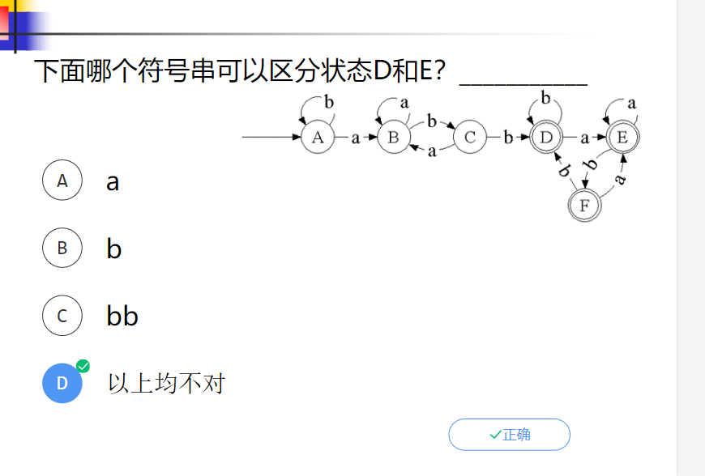
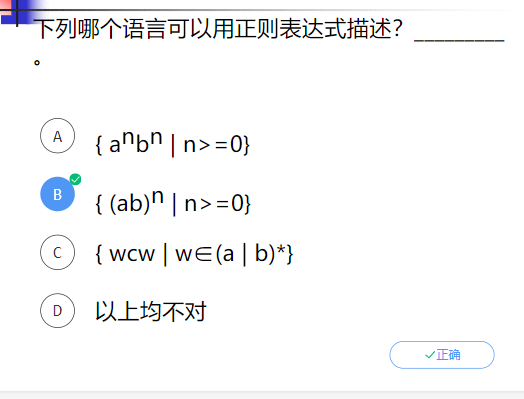
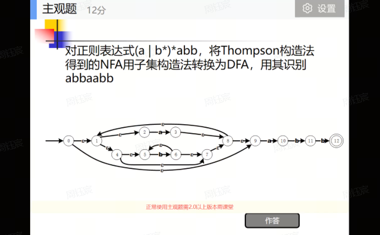

# Compiler2023

*by 2111408 周钰宸*

**==词法分析，语法分析是重点==**

**先搞清基本概念**

**1月11号，结束。**

## Chapt 1

符号表创立：词法分析

词法语法分析

（回去听录音）

如何组织：前端后端，中端

语法结构少了组成成分

类型转换是在类型检查阶段中，语义

编译器之后的连接器等也要看

可重定位机器码——Load阶段

早期Basic语言：解释器——源程序一条条的读出来，解释执行

编译器——可以脱离源代码

雨课堂题目

## **词法分析——Lex**

1. 正则表达式（静态）Pattern——单词的描述

   语言<——>单词<——>符号串集合

   符号串（句子，字。字母表中符号组成的有穷序列）

   前缀和后缀可以为本身，也可以为空

   子串（删除前缀或者后缀）

   真（不是空或者自身）

   子序列（可以不连续，但要保持原来顺序）

   语言——一个给定字母表上的任意 符号串集合（集合大小可以无限，每个符号串长度有限）。

   （[]——空语言，{一部戏龙}——不为空集，只含空串）

2. FA（动态）Pattern：对单词的语言结构进行描述

设计正则表达式——模拟FA（算法是固定）

**因此正则和FA之间的桥梁，转换很重要**

==**都是对符号串集合进行操作。某个符号串集合该属于哪个集合。**==

切成若干段——词素，要把词素归类为单词（单词是源程序

**模式**（自然语言描述一段话，也是模式。但是需要对模式有严谨描述——计算机实现）

**正则表达式**——设计目的：描述单词。有穷符号串集合好处理。主要为了解决困难：标识符，无符号数。

**正则表达式（正规表达式/正规式/正则式）——符号串集合运算的表达式（语言运算的简洁描述）**

简单语言——基本正则表达式

语言运算——正则表达式运算

**无穷符号串集合**需要处理！无穷符号串集合转换为有限简单符号串集合进行有限次的符号串集合运算得到。

运算对象与结果：符号串集合。描述集合的运算的系统。

一部戏龙：长度为0的符号串。特殊！不是NT也不是T。

**正规式r所表示的语言L(r)。**

正规式等价，表达语言相同。

**如果是正则表达式（表达式符号串集合，即{一部戏龙}简写为一部戏龙。表示语言{一部戏龙}**

**正则表达式递归定义：a的含义也是{a}，长度为1.仅包含这么一个字符的集合。表示语言{a}**

递归结构设计CFG和正则表达式

**正则表达式运算（优先级低->高）符号串集合的运算。正则表达式的运算**

**| 或（U 并集）**

**. 连接（符号串集合的连接）**

***克林闭包（无穷变有穷，s的n次幂：自身连接n次的运算。克林闭包相当于s0∪s1...∪sn）**

**（）最高**

【字符串集合（语言运算）优先级一致】

//其他：

+正则闭包：排除0次

？：0次或者1次连接并集

[]：字符集，本质上还是并集例如[a-Z]，回去看看

1. 最基本形式（先定义基本情况：{一部戏龙}与{a}）
2. 递归：定义运算

正则定义：对子正则表达式起一个名字。更好理解

**基本概念一定要清楚，设计题（设计正则表达式或者FA。或者说它接受的串）**

**正则表达式运算理解为符号串集合的，就行。**

0(0|1)*1 | 1(0|1)*0

**首位符号相同，必须得至少有两个。提笔就写**

S-状态机

S0-初态(符号串集合)

NFA是一个M，定义的语言（NFA接受的符号串集合）——L（M）

F-终态集合（L（M））

DFA可以有一部戏龙

2^s——S的所有子集集合

确定的——一个状态发出的不同的边不可能标记相同的符号

**DFA**

优点：时间占优势

缺点：空间不占优势

**NFA**

通过子集构造法——NFA有n个，DFA最坏会有2的n次方个状态。

优点：与DFA相反。

缺点：

做法：状态表述。自己划分按照除以3的余数。符号串集合。

DFA（初态：对应一部戏龙，终态：要是别的）

**Thompson：正则表达式->NFA**

正则到DFA比较复杂。但是NFA时间性能又不好。

基本的正则表达式的语法结构只要被设计出来，其他递归组装即可

**本质是：语法制导翻译方法**

不会太复杂。总体上是前后的连接运算。

复习时候要瞬间反应起来。

如何体现NFA和DFA等价——任意符号串结果相同（接受或者拒绝）

DFA转出来一个状态。NFA转出来是一个状态集合。这两者相同。

**NFA->DFA——子集构造法。**

先算初态的一部戏龙闭包。

子集构造法（最复杂的？？

**最小化DFA**

做状态迁移。AC不可区分了。最开始分出去D，然后分出去B。

## Chapt 2

## Chapt 3

## Chapt 4 

VT VN P S

CFG与正则表示式

CFG>正则

* **正则——有限的重复与给定结构的无限重复**

  **——不能描述：平衡或者嵌套的结构：**

  

* CFG——

**正则不行，CFG行。两者都不行的例子需要熟悉。**

一部戏龙和普通边转换？

回去听录音

为什么要改写后面：

预测分析法：没有一部戏龙，也米有左公因子

1. 消除左递归：直接、间接

2. 消除一部戏龙产生式

3. 消除回路：

4. 提取左公因子：

5. 改写的原因：

   

设计CFG。递归结构必须会写。不会比讲义和作业难

aibjck(j=i+k)作业题

递归分别设计aibi等。	S->一部利空|aSb

分为j和k大小关系不同的两种拆分

**==自顶向下语法分析==**

基本概念（选择题），大题对作业难度题算法比较熟悉

细节

非终结符：STU

终结符

开始默认是最左部

**一部戏龙，是空串，既不是NT也不是T！！！！！！！**

一部戏龙写在First中，只是占位符。表示可以推导出空串。

S和T相互包含一致。

**FOLLOW中不要加入一部李龙，不可能有空，是实际的非终结符！！！！！**

**预测分析表绝对不要画一部戏龙的列！！！**

一部戏龙产生式不一定只是S->一部戏龙！！！可以是推导好多次

具体的句子分析也要会！缓冲区$开始，栈最开始`$`和S

T->一部戏龙分析时候遇到。弹出T，不要压入一个一部戏龙。不是实际上的字符。

两个`$`碰头-Accept

何时规约：栈顶句柄

句柄定义：最右推导的逆过程。产生式的一个右。

算符还是LR都是基于活前缀。

活前缀：都是最右句型的前缀。啥啥不超过。末端栈顶。保证栈中一直是活前缀。

明确知道优先级关系——自己写。

**利用产生式画局部语法树构造优先级关系表。**

算符文法

1. product右边不会有连续的NT（连续的子表达式，即没有运算）
2. 没有一部戏龙

**核心——子集构造法。**

活前缀

项目：.就是活前缀的末尾，栈顶。当前阶段性目标进展到已经把X搞到栈顶了。

分析表的归约，跟随符号放到其中。

C不在任何产生式右边——无用。

只有最后一个错了。句柄是a

这里少一道。

预测分析，算符，LR。选其中之一。

**文法拓广！！**

## Chapt 5

## Chapt 6 类型检查

## Chapt 7

## Chapt 8

## Chapt 9

## Chapt 10

**其他需要掌握的。**

了解基本概念。

语法制导翻译需要掌握的知识点。

难度就是作业难度。

不考大题。

****

语法制导定义的核心思想

前两个属于基本正则表达式，调用makeleaf。

**应该说明把明把子树存在哪。ptr这个东西类似地。**

比如R'|'R：R.ptr = makenode('|', R1.ptr, R2.ptr)

回去看算术表达式的。

设计其CFG或者

类型表达式运算。结构化类型。

等价概念搞清楚。

C——对函数结构等价。对struct名字等价。

Pascal——默认名字等价。

整体上是函数，参数也是函数。C语言参数只能传递只能传递函数指针

**中间代码生成考察：作业题**

临时名字重用：c计数器

布尔表达式（短路+not>and>or+goto隔一句）

控制流加入布尔（while和if_else都是连着两个goto，**==while一定记得最后结尾有个goto回去！！！==**）

**程序之外的可以用Lnext替代！**

**代码优化**

1. **基本块构建——找leader**

   * 程序第一条语句（看题目有没有提到程序
   * 无/有条件跳转目的语句
   * 无/有条件跳转下一条语句（容易忘！

   后面代码基本块不用显式构造

2. **流图：前驱与后继**

   看一个基本块最后一个语句：

   * 有 有/无条件跳转到B2——B2（可能是false分支的无条件跳转）1
   * 无 有/无条件跳转，紧跟B3——B3

   后面代码基本块通过goto Lnext语句**指向空气即可。**

3. **循环：**

   * 这组节点是**强连通的**（任何两个节点之间都存在一条完全包含在循环内的路径）
   * 这组节点具有**唯一的一个入口（entry）**——从循环外的节点到达循环内的节点，**唯一的途径是先到达入口节点**

4. **下次引用：从后往前扫描。**

   遇到指令i，x=y op z：

   * 在指令后加入引用信息（使用/引用(use）：语句i赋值x，j以x作为运算对象，**且i到j**无其他赋值语句）
   * x非活跃，无下次引用
   * y活跃，有下次引用为i

   后两步不可以交换。最后得到临时变量生存周期。数据流分析）临时变量名字的重用与存储分配。嵌套不可以，一上一下可以。

5. **基本优化方法(global与local)：**

   * 消去公共子表达式（local）：要求两个重复的表达式之间没有对operand的定义（再赋值）。

   * 复制传播：

     * 单路径传播：直接利用复制的源头（赋值语句的源头，即赋值语句的右式）
     * 多路径传播：两个路径有相同右式的赋值表达式。不管从哪个路径来，用同一个临时变量代替。

   * 无用代码删除：

     利用复制传播，把变量直接替换为源头的常量（debug->false，也就做常量合并）。之后可以删除一些语句（源头的赋值语句，或者if(false)语句）

   * **==循环优化：==**

     * **代码外提：提至循环外。**

       某些代码（表达式计算）与循环次数无关【**或者说做的是相同的赋值操作**】，即循环不变计算。

       或者**和循环条件有关的变量在循环内部没有对其的定义（赋值运算）——>循环不变计算。**

       eg.**while(t<=limit-2)**

       从循环内提到循环入口前。具体而言，**提到一个前驱自定义基本块中。**

     * **强度削弱：**与i, j, k多有关。**乘方＞乘除＞加减。**

       同步变化的归纳变量，**记住可能要多加使用某个归纳变量的赋值。**

       eg.**j = j - 1 ; t4 = 4 * j ---> t4 = 4 * j ; j = j - 1 ; t4 = t4 - 4；**

     * **归纳变量删除：**归纳变量即i, j, k。

       * 如果前面有归纳变量给临时变量的赋值，则用临时变量替换。（PPT）
       * 如果之前没有，新加入临时变量的赋值，必须能减少一些。

9.6和9.7的寄存器分配。

1. 目标代码生成算法（掌握）

2. 寄存器分配优化算法（理解）

   