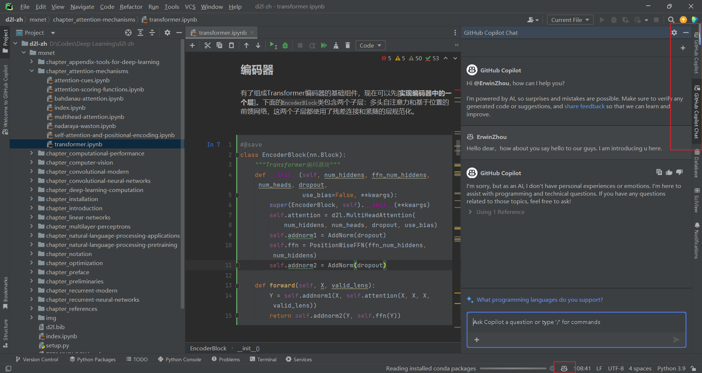
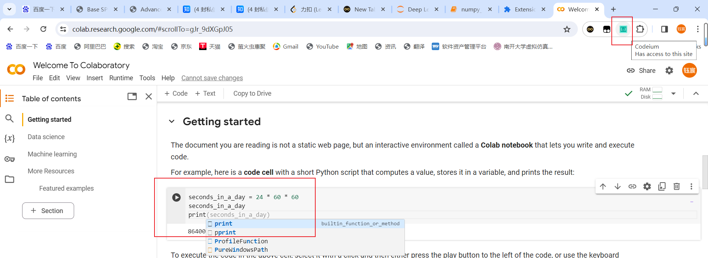

# 调研报告

## 题目：智慧编程工具软件调研

### 组号：第四组 专业：信息安全 学号：2111408 姓名：周钰宸

## 一.调研要求

本次软件工程的**第一次作业软件调研，将会围绕智慧编程工具进行调研**。主要针对以下四点题目要求：

1. *注册/下载并使用<被测智能编程助手>的主要功能，从一些评估角度对待测软件进行评分，如：不同IDE下使用体验，代码生成质量，代码可读性，安全性等。*
2. *根据你对<被测智能编程助手>的了解，分析这个软件竞争力和优劣势（和类似软件相比），指出你认为这个软件的核心目标用户和潜在目标用户？*
3. *如果你是新上任的项目经理，对于<被测智能编程助手>你有什么见解，如何提高从而在竞争中胜出？以产品功能为例：你还需要设计什么样的功能？为何要做这个功能，而不是其它功能？*
4. *如果你来开发一款新的智能辅助编程工具，你会以什么形式开发这款产品？你会怎么设计这款产品？*

## 二.前期准备

### 2.1 阅读并简要回答题目

2023年时软件工程智能化进程的重大拐点，大模型与软件工程各环节深度融合，新一代智能化软件工程（AI4SE）进入快速发展期，持续涌现出以代码大模型为首的三类大模型：代码大模型具有强大的代码理解、代码生成、代码检查、代码优化、研发问答等能力；测试大模型重点关注智能单测、测试脚本生成、测试数据生成等方面；运维大模型关注运维知识问答、工单处理等方面，未来将从故障识别、故障预测、运维安全等维度推动AIOps全过程智能水平提升。

你是否了解现有的智慧编程助手？未来在你编写代码时，是否会考虑使用代码模型辅助完成开发？请比较至少3个智慧编程工具，列出它们的优缺点和特色，以及改进思考。

**回答：**我在上学期就通过注册GitHub的Student Development Pack获取了GitHub Pro一年的使用权，目的就是为了第一时间体验最新版的Copilot。我已经使用它来辅助我编程将近4-5个月了。**可以说我对智慧编程助手早已有一定程度的体验和了解了**。

除此之外，我认为与其说网上流程的AI的出现在让软件工程这个行业落幕，不如说是代表着新时代的到来。**我认为未来使用代码模型辅助完成开发是一项必须具备的技能**，它能够帮我们省下很多不必要的时间，带来很多开发时的方便。

**==以上回答来自调研之前的我的体验，在调研后相信会为我带来更加具有深度和全面的思考。==**

### 2.2 软件安装

这里以GitHub Copilot为例，展示以下我的IDE安装情况。作为我第一个接触到的智慧编程工具。

1. **获取Pro并阅读文档：**获取GitHub Pro后，即可通过GitHub账号登陆各种IDE，然后根据官方文档提示安装Copilot。


2. **安装至各种IDE：**

* **Visual Studio Code：**

   

* **Visual Studio 2022：**

   

* **IntelliJ IDEA：**

   

* **Pycharm：**

   

## 三.调研过程

**以下我将对各个智慧编程工具，针对尽量包括但不限于的以下方面进行软件功能分析。**并进一步思考：

* 代码生成
* 代码修正
* 代码问答
* 注释生成
* 代码测试
* 安全性
* 其他功能

### 3.1 国外工具

#### 3.1.1 GitHub Copilot

##### 3.1.1.1 功能评估

1. **功能展示：这里我会首先以VSCode作为IDE为例，详细展示其功能。**

   

   总体来讲，具有**代码生成，代码修正，代码问答，注释生成，代码测试，终端提问，VSCode提问（仅限于拓展开发），快捷生成Notebook或者工作区代码，语音问答等功能。**

   **==接下来详细地一一测试：==**

   * **代码生成：**可以看到以一道LeetCode题为例，它会自动根据函数名字，参数和一些注释自动推断并能给出浅色的代码建议。此时如果按下**"Tab"键**便相当于是接受建议，就会生成代码。

     

   不过其最有用的功能不在于直接把代码生成给你。我认为这样反而一定程度上限制了我们程序员思考的能力。**这点缺陷我会在后面阐述。**

   * **代码修正：**这里以一道Leetcode题目为例，可以看到在光标框起来代码块后，通过简单`/fix`命令就可以进行修正。**并且修正的内容都会通过绿色的框高亮出来，供程序员参考和选择是否接受。整体来说较为人性化。**

     

   * **代码补全：**而真正有用的在于如图下这种快速的填充好for循环的剩余部分。以及一些重复劳动。经过我长久以来的尝试，**其代码补全比直接的代码生成功能具有更高的质量和更大的作用。较高地提高了效率。**

   

   * **代码问答：Copilot的代码问答功能十分全面。其中可以针对以下三大方面**

     

     * **Terminal:**终端使用。

     * **VSCode:**VSCode本身使用

     * **Workspace:右侧工作区文件代码进行发问。**

       * /explain
       * /fix
       * /new
       * /newNotebook
       * /tests
       
       
     
     **这里以==光标选中==右侧的代码为例。**可以看到Copilot能够较好地针对选中代码按照我的要求回答并解释含义。
     
     
     
   * **注释生成：**这里以我上学期计算机网路课的`Reliable UDP`的C++代码为例，令GitHub Copilot的`/doc`自动为我生成对应的注释。

     

     

     ```c++
     /**
      * Performs the handshake process between the server and the client.
      * This function receives a connecting request from the client, sends a SYN+ACK response,
      * and waits for an ACK from the client to establish the connection.
      * If the handshake process fails, it returns a failure flag.
      *
      * @return 1 if the handshake is successful, -1 if the handshake fails.
      */
     ```

   可以看到**代码生成的注释质量还是较高的。能够较好地描述清楚过程的功能，返回值等。**

   * **代码测试：**接下来以上学期课程密码学的`Simplified ECDSA`为例，测试代码测试的能力。直接选择所偶要测试的代码块后输入`/test`命令即可。

     可以看到它为我自动生成了代码，但是是另外生成了一个cpp文件，也没有`main`函数。就很奇怪，而且它只是为我其中的一个辅助函数`AddTwoPoints`进行了样例编写，而不是我整个主要的`Simplified ECDSA`功能。
     
     
     
     在我重新尝试只选中`main`函数进行样例测试编写，生成的测试样例还是准确度很差。**说明代码测试方面GitHub Copilot并不完善，仍有待提高。**
     
     
     
   * **终端功能：**可以直接对终端进行提问，可以说是对Linux的Shell狂热者很友好了hhh。

     毕竟俗话说的好：*Where there is a shell, there is a way.*

     在生成内容后，**也可以直接将内容插入到终端中运行，十分方便。代码质量也是可以的。不过也和我测试的任务较简单有关。**

     

   * **VSCode提问：**可以看到如今的GitHub Copilot还可以对VSCode自带的一些功能或者疑问进行提问。不过可以精确提问的方面局限在了`API`即插件上。

     

2. **不同IDE下：**

   * **Visual Studio 2022：**在Visual Studio 2022中，只有部分功能即**代码补全和根据注释生成代码。代码问答，代码修正等功能都没有实现。整体来说功能比较有限。**下图展示了代码补全的功能。
   
     
   
   * **Pycharm：**在Pycharm中，Copilot功能变得更加多元化。我个人认为更加针对于Python的深度学习的复杂网络框架等任务。
   
     具体而言，功能包含以下：**代码生成、代码补全，代码问答，代码修正，注释生成。除此之外，相比于VSCode多加了代码简化和反馈的功能。后面会重点体验和展示代码简化和反馈。其余功能和VSCode非常类似这里不再重复展示。**
   
     除此之外，还加入了**针对特定脚本进行提问的功能，可以同时对多个文件进行提问。这一点也是让人眼前一亮。如下图红圈所示。**
   
     
   
     * **代码简化：**这里通过一个简单的`LeetCode`的`TwoSum`程序，来验证其简化能力，先提供一个简单的复杂度为`O(n^2)`的程序：
   
       ```python
       #!/usr/bin/env python
       # -*- encoding: utf-8 -*-
       """
       @Project ：Pycharm Copilot Test
       @File    ：test.py
       @IDE     ：PyCharm 
       @Author  ：ErwinZhou
       @Date    ：2024/3/9 9:08 
       """
       #
       # @lc app=leetcode.cn id=1 lang=python
       #
       # [1] 两数之和
       #
       # @lc code=start
       class Solution(object):
           def twoSum(self, nums, target):
               """
               :type nums: List[int]
               :type target: int
               :rtype: List[int]
               """
               for i in range(len(nums)):
                   for j in range(len(nums) + 1):
                       if nums[i] + nums[j] == target:
                           return [i, j]
               return []
       # @lc code=end
       ```
   
       之后直接通过`\simplify`优化，结果如下。
   
       ```python
       class Solution(object):
           def twoSum(self, nums, target):
               """
               :type nums: List[int]
               :type target: int
               :rtype: List[int]
               """
               num_dict = {}
               for i, num in enumerate(nums):
                   if target - num in num_dict:
                       return [num_dict[target - num], i]
                   num_dict[num] = i
               return []
       ```
   
       
   
       可以看到轻松地将程序复杂度通过`HashTable`从`O(n^2)`降低到了`O(n)`。也没有改变其正确性，**这种简单的代码简化质量还是非常可观的。不过后续我尝试其它复杂简化时，代码正确性出现了问题，证明仍有待提升。**
   
       * **代码反馈：**主要就是一个通过`thumbs up/down`为`Copilot`提供反馈。
   
       
   
   * **IntelliJ IDEA：作为==开发最重要的语言之一——JAVA，IDEA的Copilot想必是重点的考察对象之一。==**
   
     不过从下图可以看到其主要的功能实际上和Pycharm类似，即**代码生成、代码补全，代码问答，代码修正，注释生成。除此之外，相比于VSCode多加了代码简化和反馈的功能。**这里相同的功能便不再重复赘述，**只进行简单展示。**
   
     
   
     * **代码补全：**这里以我之前数据库课程最后的`Premier League`数据库管理系统程序为例。
   
       
   
       * **注释生成：注释生成的功能对大型软件开发项目来说十分重要。**下图展示，看起来质量还是相当可观的。
   
         

##### 3.1.1.2 总结与思考

1. **优势：**

   * **代码问答功能**，省去了额外打开ChatGPT等大语言模型在网页中来回切换的麻烦。可以在IDE中直接对疑惑的地方发问并获取解答。

   * 代码问答的**光标选中功能**：可以通过将鼠标光标选中部分代码，只针对该部分代码提问，非常有效，省去了将需要提问的部分代码复制的麻烦。

   * “它真的很懂你”：有些**重复劳动力的代码，Copilot能够准确预判你的想法，并帮助你省去重复代码的时间。**

   * VSCode除了代码外可以询问关于终端以及VSCode的部分功能。Pycharm和IDEA可以针对大型项目的各种特征进行**针对文件**提问，或**代码优化**。

     这样对时间复杂度进行优化的Python设置，对复杂的神经网络训练十分重要。哪怕是看起来并不可观的性能提升就可能带来算力的指数级优化，**==这无疑对当今大模型和GPU当道的时代是有一个有用的功能。==**同样对于IDEA的JAVA语言，降低时间复杂度，也意味着更好的交互性能。

   * **可以随时关闭和打开**，方便程序员使用。

   * **整体使用来说较为简单和简洁，易上手。**

2. **劣势：**

   * **可读性较差：**部分直接生成的代码可读性较差，缺少注释和解释。
   * **隐私和安全风险**：需要访问大量代码库和用户输入数据，可能存在隐私泄露和安全风险。
   * **依赖性**：过度依赖可能会降低开发者的编码能力和创造性，导致对自身编程技能的依赖性增加。经常出现补全可能会打扰程序员开发时候固有的思路。
   * **不适用所有场景：**测试功能生成的测试样例很多没动脑子。。质量较差。**适用于一些常见的编码场景，但在某些复杂或特定领域的编码需求下，可能无法提供有效的帮助。**无论是代码修正，代码简化，代码补全，针对于较为复杂的程序都会出现问题，正确性会有所下降。实际上这也是大模型如今写代码的一大固有问题，仍有很大的进步空间。
   * **Github Copilot for Enterprises没有帮助**：这一点我通过查阅资料了解到，GitHub Copilot虽然推出了“企业计划”，但Github Copilot for Enterprises没有解决任何这些企业需求。具体而言没有代码安全性的保证，没有为代码库进行自定义，同时只有自动完成功能。

##### 3.1.1.3 目标用户和需求分析

**需求分析是要解决系统需求做什么的问题，以此界定系统功能和非功能性的内容。**

进行需求分析是十分必要的，只有这样我们才能根据需求开发出真正有市场的软件，让更多的客户满意。

这里我综合上述的各个`GitHub Copilot`的优势和劣势。提出我的个人见解。

1. **目标用户：**
   * **初学者开发者**：能够帮助初学者快速理解和学习编程语言的语法和惯例，提高编码效率。
   * **中级开发者**：对于中级开发者来说，可以提供快速的代码原型和解决方案，节省时间和精力。
   * **团队开发者**：团队开发者在协作开发过程中，可以提供一致的编码风格和标准，提高团队的开发效率和协作质量。
   * **非企业用户：**由于Github Copilot for Enterprises对企业具有各种不友好的设置，其主要针对于个人程序员的开发。

2. **需求分析：**
   * **提高编码效率**：用户希望通过快速生成代码片段和解决方案，节省编码时间。
   * **提高编码质量**：代码正确性能跑毕竟是第一位的。用户希望能够提供高质量的代码建议和提示，减少编码错误。
   * **个性化定制**：由于Copilot针对一些复杂的代码或者特定任务代码仍然存在问题。因此用户可能希望能够根据个人习惯和需求进行定制，提供个性化的代码生成和建议。
   * **安全和隐私保护**：用户可能希望能够保护用户的隐私数据和代码安全，避免泄露风险。
   * **更为完整的功能：**不同的IDE例如我上面提到的Visual Studio2022就存在功能不完整的情况。因此用户可能需要在不同的IDE下能够针对性地补上对应语言的特点功能。

##### 3.1.1.4 改进建议

1. 将代码补全功能改为对不完整的代码补全。或者仅对部分较为简单的代码生成。完整的算法生成只通过/new生成。
2. 进一步完善对代码**可读性的改善**，可以自动在生成的代码关键位置添加一些注释。
3. 光标选中的代码区域的**测试样例质量较差，有待提升。**
4. 对**Visual Studio2022**补充其代码问答等功能。
5. **增强对隐私的保护和对企业的支持：**Github Copilot for Enterprises需要尽可能地提供对企业用户的各项需求，同时保护对用户的隐私数据等。

#### 3.1.2 Codeium

##### 3.1.2.1 功能评估

之前在GitHub Copilot中已经对一些常见的智慧编程工具的功能进行了演示和体验。**==后面的工具将会着重关注其和GitHub Copilot之间的一些不同点和创新点。针对性的进行调研。==**

1. **功能展示：**

首先先打开看到Codeium的界面，需要官方注册一个账号。这里首先还是以VSCode为例进行调研。可以看到其界面相比于**Copilot的聊天问答更加复杂。**

总的来讲，Codeium包含的功能有**代码补全，代码（针对性）生成，代码修正并寻找潜在Bug，更加全面的代码问答（针对特定函数，类，仓库与终端），代码整理，更加任务导向的注释生成（普通注释+详细注释+调试注释），代码测试，强类型生成，代码搜索，谷歌插件**等功能。


* **代码补全**

* **注释生成：**Add comments and docstrings to the code

  

* **添加方便Debug的注释：**Add logging statements  so that it can be easily debugged。这一点无疑是

  ****

* **代码整理：**Clean up this code。

  对给定的代码进行优化和整理，使其更易于阅读、理解和维护。这通常包括去除冗余代码、优化算法、**提高代码的可读性和可维护性**等操作。

  

* **代码修正与寻找潜在的bug：**Check for bugs and null pointers

  

* **代码针对性生成**：Implement the code for the TODO comment。**可以看到它根据我的要求修改了代码。使用特定的类引用解决了问题。**

  

* **代码测试：**Generate unit tests。**可以看到它为我自动生成了检测函数正确性与否的代码。**

  

* **使这段代码具有强类型：**Make this code strongly typed

  在编程中，强类型指的是编程语言在编译时能够严格检查数据类型的一种特性。强类型的编程语言要求在进行操作时严格遵守数据类型的规定，不允许隐式类型转换或混合不同类型的数据。通过使代码具有强类型，**可以提高代码的可靠性和可维护性，减少类型错误的发生。**

  可以看到程序中一些冗余的部分就被去掉了。

  

  

* **代码优化（效率提升）**：Make this faster and more efficient。经过验证效率提升后的代码不仅通过了测试，并且运行速率有了大概30%左右的提升。**说明其既保证了正确性，又能一定程度上有效地提升性能。**

  

  

* **详细注释：**Verbosely comment this so that I can understand what's going on。可以看到Codeium为我的程序产生了极为详细的注释文档，不仅在整个函数开头，在每个关键语句之前都有详细注释。**这很大程度上提高了代码的可读性。**

  

  

* **代码问答**

  可针对于特殊函数与特殊类：下图展示我针对特殊函数提问其时间复杂度的例子。在Copilot的Pycharm插件针对特定文件的基础上，Codeium甚至可以针对殊函数与特殊类，自动检测所有的类和函数，**这无疑可以让定位更加精确，对大型工程的作用更加显著。**

  

* **代码搜索：我发现虽然Codeium具有着代码搜索的功能，不过经过我的多次反复尝试，其并没有显示出搜索结果。**根据文档提示，它会一定程度上减慢其它线程任务的速度。**这一点我觉得有待改进。**

  

* **==谷歌插件：==Codeium是唯一配备了谷歌插件功能的智慧编程工具，使得其可以在各个常用编程平台如Colab或者Jupyter Notebook中持续提供服务。**

  

  如下图所示，我在谷歌插件商店中安装了相关插件后，现在在Colab中**就能看到它很明显的代码补全提示了。**




2. **不同IDE下：**

   * **Pycharm：**Pycharm中功能相比于VSCode有所减少，变成了针对函数，类，git仓库提问。**除了基础的代码补全和代码生成外，代码Refactor功能也需要选中对应的代码块后不是通过Ctrl+I而是通过右键即可显示。因此保留了和VSCode几乎一样的功能。这一点相比于Copilot是极大的进步。**

   

   

   

   * **Visual Studio 2022：**可以看到（我Disable了GitHub Copilot）Visual Studio2022中的使用效果**和Pycharm中极为类似**，保留了基础的代码功能即代码补全和代码生成。同时也可以代码问答。另外所有的代码
   
     

##### 3.1.2.2 总结与思考

1. **优势：**

   * **Chrome插件：Codeium是唯一能在浏览器中运行的AI自动完成产品。** 在官方网站的Web Playground中可以尝试无需任何安装即可使用。

   * **安全性及对隐私保护较强：**可以根据选项选择是否分享隐私数据。

   * **提供GPT-4等更为强大模型：**相比于Copilot的基础大模型，Codeium还会提供GPT-4的内嵌。我也是听说有了后很快就加入了Waited List。

     

     

   * **Codeium Search：代码搜索功能。**虽然仅在VSCode中有，但是仍然相比于其它智慧编程工具更为出色。

   * **基础功能更为强大，任务导向性更强：Codeium让我最为之惊艳的就是其超全面的基础功能和任务导向。**可以为更多更加详细的任务直接生成，很多对代码维护，提高鲁棒性和可读性极其重要。

2. **劣势：**

   * **Codeium Search仅适用于VSCode**，并针对Python，JS，TS和Go文件进行操作。有待进一步拓展。

   * **好像暂时只有中文hhh：**
     

   * **代码搜索功能性能较差：**Codeium的代码搜索功能往往需要很久时间才能出现结果，而且根据提示，它会一定程度上减慢其它线程任务的速度。

     

3. **和GitHub Copilot对比：**

   

   * **对企业的支持：**

     * **Github Copilot for Enterprises没有帮助**。Github Copilot推出了“企业计划”，但Github Copilot for Enterprises没有解决任何这些企业需求：
   
       - **没有代码安全性的保证**。保护与个人计划相同，代码片段被发送到Github、Microsoft和OpenAI服务器，且未明确代码保留和使用政策。应该对安全和隐私有所担忧。
       - **没有为您的代码库进行自定义**。你只能获得通用模型，没有任何自定义。最好的做法是使用公司的框架和库，不这样做会降低可读性，并引入技术债务、性能问题和安全漏洞。
       - **只有自动完成功能**。Copilot只执行自动完成操作，而该功能在过去一年左右没有得到实质性改进。此外，Copilot也无法在每个IDE和平台上工作，例如在线笔记软件，这对于使所有开发人员更具生产力至关重要。
     * **Codeium for Enterprises有所帮助。**Codeium for Enterprises实际上解决了企业的需求：
       
       * **完全部署在企业的本地或虚拟专用云（VPC）上**。保证安全的最佳方法是不允许数据离开公司管理的资源。在自托管方式下部署Codeium for Enterprises。计算要求也很低，所以也不会为此而掏空钱包。如果不想本地部署，很快就会提供SOC2合规的托管服务。
       * **完全在自托管的Codeium实例中对现有存储库微调模型**。无论是哪种部署方法，通用模型都不能提供与微调模型相同的生成质量。Codeium的基础质量与Github Copilot相当，因此微调肯定会胜过任何需求中存在的任何内容。在自托管实例内进行微调意味着您的数据将不会离开程序员的管理，并且没有人会获得暂时或永久的访问权限，包括Codeium工作人员。这些模型将自动部署在您的自托管Codeium实例中——模型权重将永远不会离开企业的实例。
       * **全套AI编码加速工具**。开发者们将Codeium称为工具包而不是工具。 已经提供了Autocomplete on Enterprise，并正在积极开发Unit Test Generation、Doc Generation等。还有关于Search for Enterprises（已经提供给个人）、Chat、PR Review Automation、Debugging等更多想法。
       

##### 3.1.2.3 目标用户和需求分析

根据之前提到的诸多特点，可以分析Codeium的目标用户和需求如下：

1. **目标用户：**
   * **开发者和编程爱好者**：提供了强大的AI自动完成功能和GPT-4模型，适合需要高效编程辅助工具的开发者和编程爱好者使用。
   * **注重隐私和安全的用户：**提供了对隐私保护较强的选项，适合注重隐私安全的用户选择使用。
   * **任务导向性强的用户：**基础功能强大且任务导向性强，适合需要针对具体任务生成代码的用户使用。
   * **需要代码搜索功能的用户：**提供了Codeium Search功能，适合需要快速查找和操作代码的用户使用。

2. **需求分析：**
   * **多语言支持和拓展：**用户希望部分功能和支持范围能够扩展到更多编程语言和开发环境，而不仅限于VSCode。
   * **提供多语言界面：**用户希望能提供多语言界面而不只是英文，以便更广泛地服务全球用户群。
   * **持续优化和更新：**用户希望Codeium能够持续优化和更新，提供更稳定、高效的编程体验。
   * **社区交流和支持：**用户希望能够在Codeium平台上进行交流、分享经验，并获得来自社区的支持和帮助。

综合来看，Codeium的目标用户主要是注重效率、隐私和安全的开发者和编程爱好者，以及需要强大功能和任务导向性的用户。他们的需求主要是在一个安全、高效、功能强大的平台上进行编程工作，并希望平台不断更新和优化以满足不同的编程需求。

##### 3.1.2.4 改进建议

1. **Codeium Search：**功能有待拓展到其它编程化工具中。并支持更多语言。并进一步优化其性能。
2. **界面及功能简洁化：**个人感受虽然Codeium的能力相比于Copilot更加全面，但是给我的第一感受是上手起来较为缓慢。因此我认为Codeium可以尝试提供一些针对于简单编程目的的程序员的更为容易上手的版本。
3. **提供多国语言支持**

### 3.2 国产工具

#### 3.2.1 CodeGeeX2

##### 3.2.1.1 功能评估

~~一映入眼帘的广告真没绷住。。。。。。~~

Anyway，多语言代码生成模型 CodeGeeX 的第二代模型。是完全国产化的智慧编程工具，接下来就让我们体验下其对应的功能。

同样地总体来说，其功能具有：**代码补全，代码生成，代码问答（代码+git仓库），注释生成，代码测试，代码修复，同时也具有完全免费的两个大模型CodeGeeX Lite和Pro（分为快速和准确，并且都是免费的），另外其还具有神奇的工具箱和代码翻译功能。其中工具箱就是一些比较快捷的小功能。另外还有神经网络AI自动编程。**

同样**==下面将会针对于其有别于其它智慧编程工具的特点进行重点展示。==**


1. **功能展示：**

   * 代码补全

     

   * 代码生成

   * 注释生成：其**代码注释生成等功能不会提供可选项**，在对选中代码块进行操作要求后会直接进行修改。**==没有可以选择是否accept的选项。这一点十分不人性化。==**

     

   * 代码问答：这里的亮点是可以**快速进行中英文切换。同时选中的代码部分会在左侧问答区显示出来。这样方便更好地阅览。**

     

     
     
     除此之外，可以看到**它的每个问答框都在右上角有个特殊的选项。可以将代码问答的结果进行对比显示等，进行多种操作**，这一点还是有别于其它的工具的。
     
     
     
     这里看到我是将两个模型的代码结果，一个放在粘贴板里面进行对比，结果如下图所示，**还是比较清晰的。这有助于对代码结果的采纳。不过就像我上面说的直接在代码选中用Ctrl+I生成改进却没有accept与否的选项。**
     
     
     
     另外官方文档中说明“依托于ChatGLM2-6B基座模型，CodeGeeX2-6B支持的上下文长度提升到了32K。基于这一新特性，可以将当前工程中其他文件的内容也作为上下文引入，这使得模型在生成时可以更好地理解当前开发任务。”**证明其可以容纳更多的文本内容，这无疑对一些复杂的错误原因Debug十分重要。能提供更多的信息，也意味着其回答的准确性会有保障。**
     
   * 代码测试：直接采用注释方式生成，和Copilot类似，**质量和正确性较差。**
   
     
   
   * 代码修复
   
   * **==工具箱：==这里可以看到具有着很多特别的快捷功能，其中大部分都是针对于VSCode的配置文件JSON，因此可以推测其工具箱中大部分功能都是为了VSCode更好地使用制作的。**
   
     根据官方文档所述，**==其包含的功能有批量处理文件，批量处理数据与可视化，绘制数学函数图，分析代码文件，多种格式的文件处理。==**
   
     
     
     这里简单地体验了一下其生成二维码的功能，就类似于GPT-4现场生成python代码处理一样，**会显示处理过程和结果。**
     
     
     
     另外一点非常惊艳的是，工具箱功能竟然可以针对**==特定上传文件如图片，脚本等进行提问和处理==。这一点是之前的智慧编程工具都不具备的，只有GPT-4和Bing有这种功能。这完全可以当作一个小GPT4用，而不仅是智慧编程工具。**
     
     
     
     
     
   * **==代码翻译==：这也是CodeGeeX的亮点之一。**根据官方文档描述，该功能旨在“从一种编程语言翻译成另一种编程语言，使用场景比如在网上找到了Java的实现，需要转成Go，只需要在CodeGeeX上粘贴然后转换即可，**是一个比较实用的功能。**”
   
     
   
   * **双模型切换：不过我对比并没有发现二者有太明显的区别。**不像是GPT4和3.5那种明显的速度差距。看起来应该差异不大。

​			

   * **AI自动编程：这一点虽然我没有能够很好的平台进行验证，不过根据官方文档描述，这一点对与繁琐的神经网络调参无疑是一项重要的功能。**

​		


2. **不同IDE下体验：**

   * **Pycharm：**在Pycharm中由于主颜色是黑色，因此其亮绿色看起来更加炫酷一些。十分惊喜。**另外其IDE功能与VSCode几乎保持一致。这一点也十分全面。其余JetBrains IDE也全部支持，这里不再演示。**

     

     

   * **Visual Studio2022：==不支持竟然。==**

##### 3.2.1.2 总结与思考

1. **优势：**

   * **安全性较强：**至于代码安全问题，CodeGeeX会明确提示你是否允许存储和使用你的代码用于训练，点拒绝就可以了。还有一种方式，因为CodeGeeX是开源的，可以自行部署使用。

     

   * **代码开源：**没有因为商业性而将代码拒绝开源是一项不小的成就，这一点为未来更好地工具提供了借鉴与参考，值得夸赞。

   * **代码问答功能高级**：其工具箱功能类似于一个简化版的GPT-4，可以对特定任务进行快速完成。其中甚至可以上传文件进行提问，虽然其能够发问的方向并不是很多，但是**这一点功能十分强大**。另外能容纳更多的文字，一个项目的代码风格和功能模块的写法都是类似的，这个功能在本地代码越多的情况，提示也就越精准，可以大大减少复制粘贴的时间，提高编程流畅度。

   * **代码翻译功能很有创新**

   * **AI自动编程辅助神经网络调参**

2. **劣势：**

   * **==广告。。。。：==**太降低档次了。。。

   * **缺少人性化代码Accept：**提示代码任务后会自动生成，没有给程序员提供接受与否的机会。
   * **部分功能强大但比较偏：**相比于Codeium的各种Refactor的强大功能，CodeGeeX2的工具箱和代码翻译都显的有点鸡肋，**有点写的很好，但跑题了的感觉。**
   * **不支持Visual Studio2022**

##### 3.2.1.3 目标用户和需求分析

根据前面所述的优势和劣势，我们可以进行目标用户和需求分析：

1. **目标用户分析：**
   * **开发者群体**：CodeGeeX 的安全性较强和代码开源特点对注重代码安全和可追溯性的开发者群体具有吸引力。同时，AI**自动编程辅助神经网络调参功能也对寻求效率和创新的开发者具有吸引力。**
   * **学习者**：代码问答功能高级和代码翻译功能的创新性可能对学习编程的新手或者学生群体有吸引力，因为这些功能可以帮助他们更快速地理解和应用编程知识。

2. **需求分析：**
   * **安全性需求**：用户对代码安全和隐私保护的需求是一个重要考量因素。CodeGeeX 提供的明确提示和自行部署选择能够满足用户对安全性的需求。
   * **功能偏好**：用户可能会更倾向于使用功能强大且易用的工具。因此，对于部分功能偏强大但比较偏的问题，可以考虑优化或者添加更加实用的功能，以提升用户体验。
   * **集成需求**：由于不支持Visual Studio 2022可能对部分用户造成不便，可以考虑增加对更多IDE的支持，以满足不同用户的集成需求。

综合以上分析，**CodeGeeX 可以着重在提升功能的实用性和用户体验上进行改进，同时保持对安全性和隐私保护的承诺，以满足不同用户群体的需求。**

##### 3.2.1.4 改进建议

1. **删除广告**：第一要务，真的。
2. **提供代码Accept功能。**
3. 学习国外智慧编程工具，学习**更为核心的功能。**
4. 拓展至**更多IDE**支持。

#### 3.2.2 通义灵码

##### 3.2.2.1 功能评估

*”通义灵码-灵动指间，快码加编，你的智能编码助手“*

**~~这口号真的难蚌......名字也是有点文心一言那种经典的山寨冒牌货的感觉。（这是可以说的吗）~~**

1. **功能展示：**

来到界面，其界面相对来说比较简单，没有太多花里胡哨的功能。**还是先对其功能进行总结，其首先具有基础的代码补全，代码生成，代码问答，代码测试，注释生成，代码测试，代码优化功能。另外还具有比较有特色的异常报错智能排查和阿里云平台支持功能。**


* **代码补全，代码生成，代码测试，注释生成，代码优化：这些功能都十分常规。**值得一提的是：其**可以自动识别函数和代码块**，这一点类似于Codeium。其**选择某部分代码后生成对应注释和修改都不会在代码本身上修改，而是通过左侧的代码问答方式展示**，这种方式说实话还需要去粘帖，效率较低，不过相比于CodeGeeX2也相当于是给了程序员能够思考并接受建议的机会。**==这部分功能还不够强大。==**

  

* **代码问答：**其代码问答功能和CodeGeeX2一样，可以方便地对结果进行评测，在右侧进行对比筛查。

  **==另外其具有自然语言的特性，==**根据网上某位测评人士评价道，我在这里引用：

  *”**通义灵码的自然语言生成代码功能非常强大**，相比传统的分散搜索，这种基于自然语言理解后生成的代码，更加直接、准确，并且极大的降低了开发的门槛。这种生成代码功能和代码自动补全、代码解释结合起来，基本可以在一个IDE内实现编码、搜索、测试等开发流程的闭环，体验极好、效率也更高。“*

  ——https://developer.aliyun.com/note/257415578?spm=a2c6h.28630436.J_2443807630.147.46e8146eTk6AjG

  

* **异常报错智能排查：这一神奇的事，这个功能不在VSCode中具备。**根据我的测试，在VSCode报错后其并没有在报错信息周围有工具的智能提示。

* **==阿里云平台支持==：这里可以看到支持极速本地模型、云端大模型两种代码补全模型，支持一键切换，满足不同网络环境、不同补全强度的场景诉求。**

  

2. **不同IDE下体验：**
   * **JetBrains IDE全家桶：**
     
     * **Pycharm：**Pycharm中保留了通义异码的大部分代码补全，代码生成，代码测试
     
       
     
     * **IDEA：看到这个界面和功能还都是和VSCode一致的。功能也是几乎一样的，但是有一个更强大的功能。**
     
       
     
       当我们把程序调成错误时，就可以看到程序错误提示后面自带了对Lingma的提示，这便是**==功能更为强大的异常报错智能排查功能。==这无疑是一个其它智慧编程工具忘记的，十分有用的功能。**
     
       
     
       **根据官方文档也可以了解到针对于JAVA的异常报错智能排查功能。**
     
       当运行出现异常报错时，**一键启动报错排查的智能答疑，可结合运行代码、异常堆栈等报错上下文，快速给出排查思路或修复建议代码。**

##### 3.2.2.2 总结与思考

1. **优势：**

   这里由于我没有特定对阿里云服务进行体验。因此**我引用部分官方文档上的解释，对通义异码的产品优势进行总结，并加上我自己的特定理解：**

   * **跨文件感知让代码生成更贴合业务场景：**客户端和模型层同步优化针对代码跨文件上下文感知能力，生成代码更加贴合当前代码库的业务场景。
   * **==阿里云服务使用场景友好：==**专门**针对阿里云的云服务使用**、SDK/OpenAPI 的使用等场景调优，编码时能够更加便捷地使用阿里云服务；**在对阿里云使用有疑问时，智能编码助手的回答也将更加有效。**

   - **双模引擎，自由切换：**支持极速本地模型、云端大模型两种代码补全模型，支持一键切换，满足不同网络环境、不同补全强度的场景诉求。
   - **异常报错智能排查：**在Pycharm上的这个功能是我真的觉得让我眼前一亮的，其它的智慧编程工具都没有想到去设计一个专门针对报错的功能。

2. **劣势：**

   * **问答准确度不不统一：**通义灵码生成代码的准确性与输入的自然语言查询条件紧密相关，有时候需要多次修正提示词、句，才能生成最终符合条件的代码。
   * **对非阿里云用户而言功能相对单一：**坦白来讲，对于非阿里云用户，这样的工具有很多所有待提升的功能，功能单一却不全面。
   * **不能在选中代码区直接修改**

##### 3.2.2.3 **目标用户和需求分析**

基于上述优势和劣势，我们可以进行目标用户和需求分析：

1. **目标用户：**
   * **开发团队在阿里云上进行开发的开发人员：** 这些用户可以从工具提供的针对阿里云服务的优化和智能编码助手功能中受益，提高开发效率和代码质量。
   * **PyCharm用户：** 用户可能会对异常报错智能排查功能感兴趣，因为这个功能在PyCharm上是独有的，可以帮助他们更快地排查和解决问题。

2. **用户需求：**
   * **更贴合业务场景的代码生成：** 用户希望工具能够更好地感知代码上下文，生成更符合当前业务场景的代码。
   * **便捷使用阿里云服务：** 针对阿里云用户，他们希望工具能够友好支持阿里云的云服务使用，并在编码过程中提供便捷的操作。
   * **准确的代码生成和智能提示：** 用户希望工具能够提高准确度，减少修正次数，同时希望智能编码助手能够给出有效的回答。
   * **功能全面性与扩展性：** 非阿里云用户希望工具能够提供更多功能，不仅局限于阿里云服务，也希望工具能够在其他场景下发挥作用。
   * **支持直接修改选中代码区：** 用户希望工具能够支持在选中代码区直接修改代码，提高编码效率。

##### 3.2.2.4 改进建议

1. 通义灵码生成代码的准确性与输入的自然语言查询条件紧密相关，这块产品方可以后续再优化下，**提升自然语言的处理能力和推荐的精准度，这样更多==非计算机相关的人员==也能利用大模型来高效的生成代码，最终提升整体的工作效率。**
2. **支持直接修改选中代码区**
3. 吸取国外的智慧编程工具的成功经验，**丰富其功能**
4. **拓展至非对阿里云用户友好**

## 四.调研结果与思考

**总体来说，通过对两个国外和两个国内智慧编程工具进行了深入挖掘和调研，我发现了以下特点值得关注：**

1. 大部分编程工具都具备**代码补全，代码生成，注释生成，代码问答等基本功能。**
2. 部分**国产工具虽然功能没有国外工具全面**，但是具有一些更加便捷的功能例如CodeGeeX2的工具箱，同时有的能够更好地针对我们国内的开发平台，比如通义异码针对于阿里云平台。
2. **不同的智慧编程工具之间都有着不同自己创新的地方，也有彼此的短处，没有绝对的好坏之分。只有适用不同的用户和需求人群。**

**下面我将针对任务中的四个问题和汇总表格中的最后一个问题进行集中回答：**

1. *注册/下载并使用<被测智能编程助手>的主要功能，从一些评估角度对待测软件进行**评分**，如：不同IDE下使用体验，代码生成质量，代码可读性，安全性等。*

   **回答：**具体分析见上面分析调研过程，**这里直接进行综合评分。评分包括软件功能（代码补全，代码生成等七项），不同IDE下使用体验（VSCode，IDEA等），其他角度（代码生成质量，是否支持大型工程和企业等）。==各项评分细则和结果详见Excel汇总。==**

   * **GitHub Copilot：8/10**
   * **Codeium：9/10**
   * **CodeGeeX2：7/10**
   * **通义异码：7/10**

2. *根据你对<被测智能编程助手>的了解，分析这个软件竞争力和优劣势（和类似软件相比），指出你认为这个软件的核心目标用户和潜在目标用户？*

   **回答：**见上面分析调研过程。

3. *如果你是新上任的项目经理，对于<被测智能编程助手>你有什么见解，如何提高从而在竞争中胜出？以产品功能为例：你还需要设计什么样的功能？为何要做这个功能，而不是其它功能？*

   **回答：**如果我是项目经理，我认为智慧编程助手应该人如其名，“助手”。**要对主要的生产力程序员提供充分的帮助，但是决定性作用还是由人完成。**

   想要在竞争中胜出我就要思考，如果我是一个面临着某个开发任务的程序员，我会希望“有一个什么样的助手，我希望在哪些方面得到帮助？”。因此**应该以用户即开发人员为导向，针对不同的用户群体不同的需求开发不同的功能，满足各种用户的需求，才能在竞争中胜出。**

   因此以CodeGeeX2为例：就**一定需要设计加入人对于代码建议来Accept与否的选项，即助手来提供建议，而最终决定权在人。而不是像现在一样，直接将代码修改，而不是人来最终决定。**

4. *如果你来开发一款新的智能辅助编程工具，你会以什么形式开发这款产品？你会怎么设计这款产品？*

   **回答：**和上个问题一样，我会选择以用户即开发人员为导向，针对不同的用户群体不同的需求开发不同的功能，满足各种用户的需求。

   因此**我会首先以广泛调研用户需求的形式开始，然后详细划分即分为“个人版”，“企业版”，“初学者版”等多个版本的方式设计。或者是能够通过简单的操作来切换版本。**

5. *你觉得现在市场上还缺少哪种类型/功能的智慧编程工具？如果让你来开发这个工具，你会如何设计？*

   **回答：**
   
   根据我本次调研的四个智慧编程工具的结果，我认为Codeium相对个人来说是比较全能的了。但是通义异码的阿里云平台支持的能力还是让我眼前一亮。所有工具都各有所长。有的缺少安全性，有的缺少人性化。
   
   我觉得还**缺少调试型智慧编程工具**，能够对调试过程给予详细的指导，引导程序员进行大型项目的调试和测试，Debug等。
   
   因此如果让我来设计，**我会开发这种能够对调试过程变量，栈空间等提供按步指导的智慧编程工具，更准确地说应该是智慧调试工具。进行大型项目的调试和测试。**

### 感悟

本次调研作为软件工程课程本学期第一次作业，让我眼前一亮。我曾经以为智慧编程工具的出现无疑会对软件工程和开发领域带来重大的改革和重创。通过本次调研，我发现不论是国内还是国外的工具，都仍有许多不尽如人意的地方，与其依赖它们，不如让它们成为我们的小帮手。我希望能从本学期的众多实验中收获能力和感悟，能对新世代不断冲击我们的技术产生独到的思考和感悟。

正如其名"Copilot"，它只是辅助飞行员，

**而你才是机长。**

**新时代，让我们重新起航吧！**
