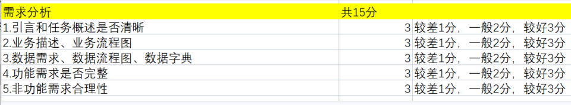

# 软件工程

## 题目：软件需求分析

### 组号：第四组 专业：信息安全 学号：2111408 姓名：周钰宸

### 一.引言

#### 1.1 编写目的

#### 1.2 项目背景

### 二.任务概述

#### 2.1 任务目标

#### 2.2 用户特点

#### 2.3 假定与约束

3分----

### 三.业务描述

#### 3.1 系统总业务流程图及其描述

#### 3.2 各个子业务流程图及其描述

3分----

### 四.数据需求

#### 4.1 数据需求描述

#### 4.2 数据流图

#### 4.3 数据字典

3分----

### 五.功能需求

#### 5.1 功能划分

#### 5.2 功能描述

3分----

### 六.性能/非功能需求

系统准确性、及时性、可扩充性、易用性、易维护性、标准性、先进性

3分----合理性

### 七.系统运行要求

硬件配置要求

软件配置要求
